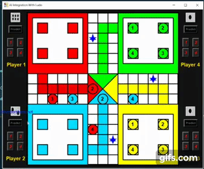

<h1 align="center"> 👋 Welcome Developers 👋  </h1>

<h3 align="center"><b>  ⌛ Now I am Presenting You my New Game ⌛ </b></h3>

<p align="center"></p>

### <p align="center"><b>💖 Yes, This is Ludo Game made by Python(Version 3) Tkinter 💖</b></p>

***

<h3 align="center"><b>🙄 But What Special 😳</b></h3>

<h3 align="center"> 1. 😲 <i>You Can Play Ludo With Your Computer</i> 😲 </h3>
<h3 align="center"> 2. 😍  <i>You Can Play Ludo With Your Friends</i> 😍 </h3>
</br>

<p align="center"></p>
<h3 align="center"><b>🙋 You Can Select Your Favourable Game Mode From Here 🙋</b></h3>

***

<h3 align="center"> 💻 <b><i>This is a Desktop App</i></b> 💻</h3></br>
<h3 align="center">💘 For <b><i>Play With Computer </i>🧐</b></h3>
<h3 align="center"><b>🎯 Computer Will Deal With ❤️ Red ❤️ and You Will Deal With 💙 Sky-Blue 💙</b></h3></br>

<h3 align="center">💘 For <b><i>Play With Friends </i>🧐</b></h3>
<h3 align="center"><b> 🎯 Minimum Players to participate: 2 Players</b></h3>
<h3 align="center"><b> 🎯 Maximum Players to participate: 4 Players</b></h3></br>

***
### ⚒️ ***_Requirements of this game:-_***
<h4>1. Python(version >3.3)</h4>
<h4>2. Pillow</h4>
<h3>🚧 To Install Pillow, Open Your Terminal or cmd and Write:-</h3>

```bash
pip install pillow
```

***

### 🎯 How to run program in your machine:
Open this folder<`AI-Integrated-Ludo-Game`> in any code editor(Recommended: Visual Studio Code) and open the <`Ludo_game_with_Sam.py`> file in your code editor.... 
Now Run the python-script and Enjoy the Game.

***
<h3 align="center"> Author: </h3>
<h3 align="center">Samarpan Dasgupta(@SamarpanCoder2002)</h3>

***

<h3 align="center"><b>💡 Some Important Links 💡</b></h3>

- [<h3>Click Here to See the Project Video</h3>](https://youtu.be/5NScX6qgd3Y)
