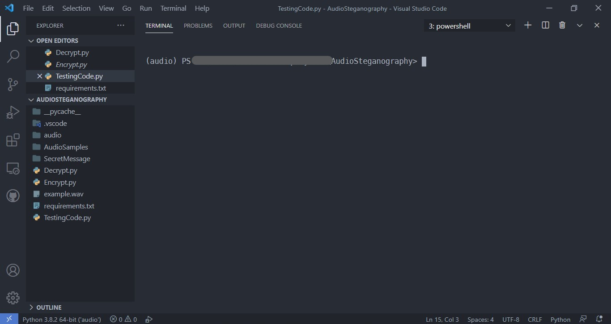
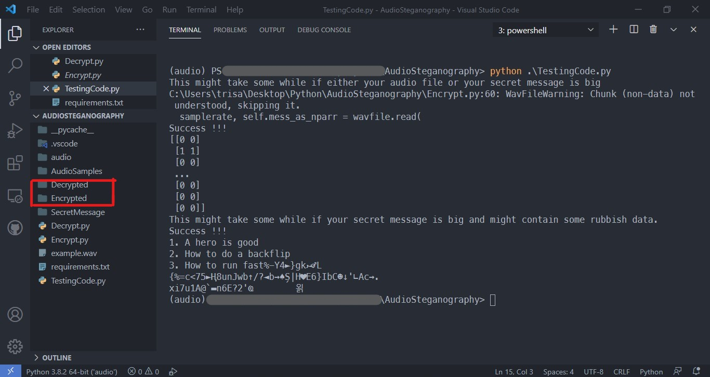

# Audio Steganography
This is a package to encrypt a given message into a .wav audio file. It can decrypt from audio as well.
- Encrypt : This is used for the encryption part. Can play the audio as well.
- Decrypt : This is used for decryption part. Can play audio as well.

## Setup instructions
- It is recommended to install a virtualenv before you proceed. This can be done by ```virtualenv {name_of_virtualenv}```
- Do 
    ```python3
    pip install -r requirements.txt
    ```
- You can import Encrypt from Algos.Encrypt and decrypt from Algos.Decrpyt
- The TestingCode.py file has an example implementation. Please refer to it if you face any issue.

## Output
- The code in TestingCode.py will produce 2 Directories as well as produce sound that is inside the .wav files that you have passed as a parameter to ```Encrypt```. 
- The Encryption and Decryption parts each will produce a directory with a name of your choice as well as file inside it containing the encrypted audio file or decrypted text file .
- An Example of what you might expect :
  - Before
    
  - After 
    

- Dont worry if your decrypted sentence looks a bit funky-it is to be expected.

## Author(s)
[Trisanu Bhar](https://github.com/Trisanu-007)
