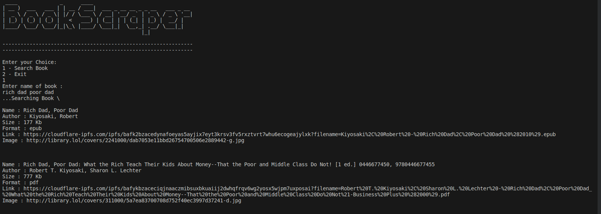
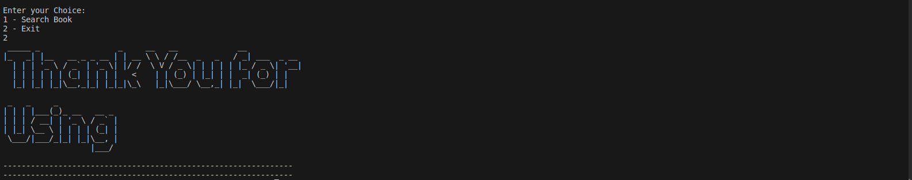

# Book Scraper
It is a Book Scraper Python Script whhich allow user to download books using console.
Ex: when a uer provides a name of a book
The script returns book name, size of book, author, extension type, language of book, book cover image, direct download.

# Installation & Run
`pip install -r requirements.txt`

`python book.py`

# Screenshots

