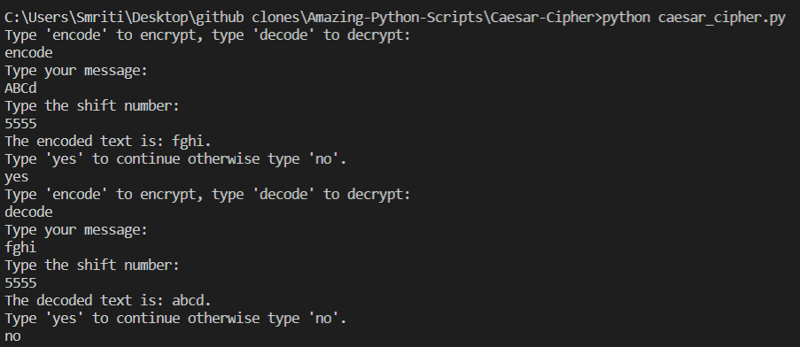

## Caesar-cipher:
Caesar's cipher, the shift cipher, is one of the simplest and most widely known encryption techniques. It is a type of substitution cipher in which each letter in the plaintext is replaced by a letter some fixed number of positions down the alphabet.


### How to run this:

- Simply copy-paste the code in your editor and run it using:

```python
python3 caesar_cipher.py
```

### Output:



> Learn more about this [here.](https://www.youtube.com/watch?v=fR8rVR72a6o)
