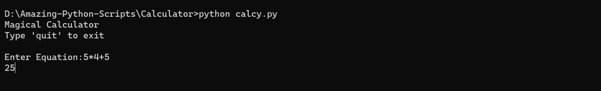

<h1 align="center">Calculator</h1>
This is a simple calculator program written in Python that performs basic arithmetic operations. It can add, subtract, multiply, and divide numbers.

---------------------------------------------------------------------

## How it works
- It takes the mathematical equation by the User.

- It returns the result of the mathematical equation.

## Usage
To use the calculator program, follow these steps:

1. Clone the repository or download the source code files.

2. Make sure you have Python installed on your system (version 3.6 or above).

3. Open a terminal or command prompt and navigate to the directory where the source code is located.

4. Run the calculator.py file using the following command:
    
    "python calcy.py"

5. The program will ask for your input.

6. Enter your desired equation.

7. The program will display the result of the operation.

## Example 

#### By [Avinash Kr. Ranjan](https://github.com/avinashkranjan)