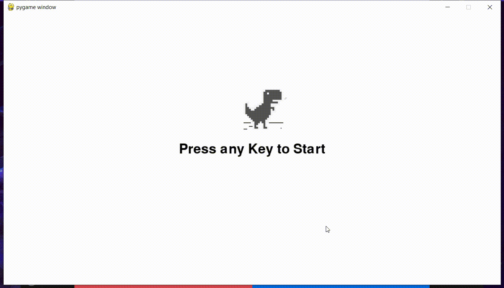

# Dinosaur Game



## Description

The Dinosaur Game is a simple game inspired by the Chrome dinosaur game. It is built using the Pygame module in Python and offers an enjoyable offline gaming experience.

## Installation

1. Clone the repository or download the source code.
2. Install Python (version 3.7 or higher) if not already installed.
3. Install the required dependencies by running the following command:

```
pip install pygame
```

## How to Play

1. Open a terminal or command prompt and navigate to the game's directory.
2. Run the following command to start the game:

```
python main.py
```

3. Use the spacebar or up arrow key to make the dinosaur jump over obstacles.
4. Try to survive as long as possible by avoiding obstacles like cacti and pterodactyls.
5. Your score will be displayed on the screen. Challenge yourself to beat your high score!

## Features

-   Simple and addictive gameplay.
-   Retro-style pixelated graphics.
-   Increasing difficulty as the game progresses.
-   Offline mode allows you to play without an internet connection.
-   Endless runner style with no defined endpoint.

## Contributor

#### This project was contributed by Atharvashirsh Tiwary.

👾 Follow me on Github : [@Atharvashirsh](https://github.com/Atharvashirsh)

🤖 Connect with me and say Hi on LinkedIn : [@atharvashirsh](https://www.linkedin.com/in/atharvashirsh)

🐦 Follow me on Twitter : [@atharva_tiwary](https://www.twitter.com/atharva_tiwary)
