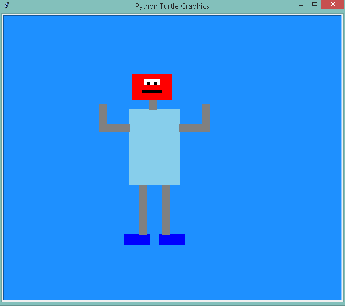
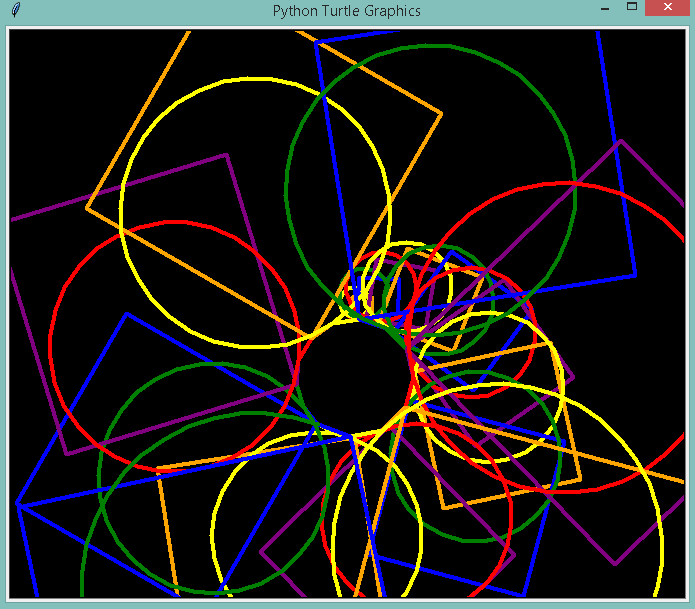
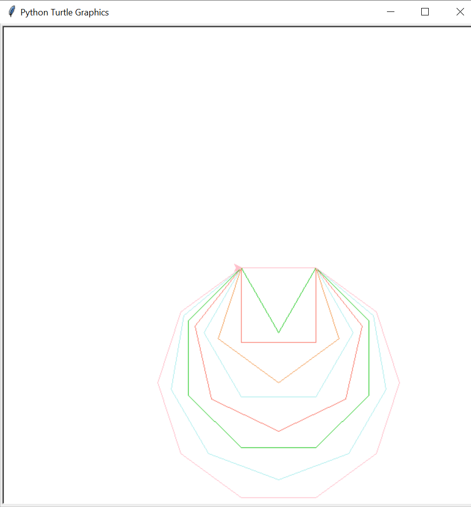
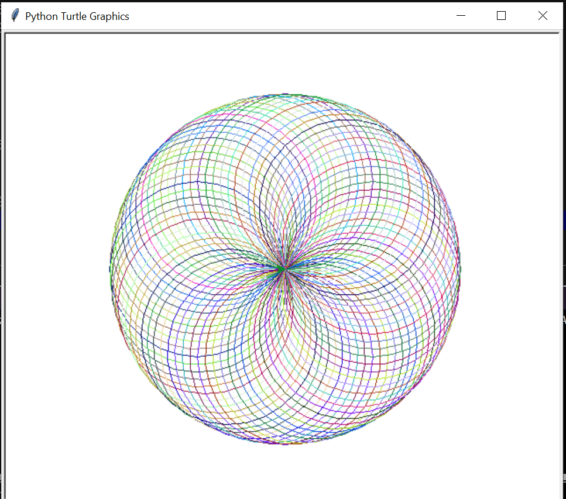
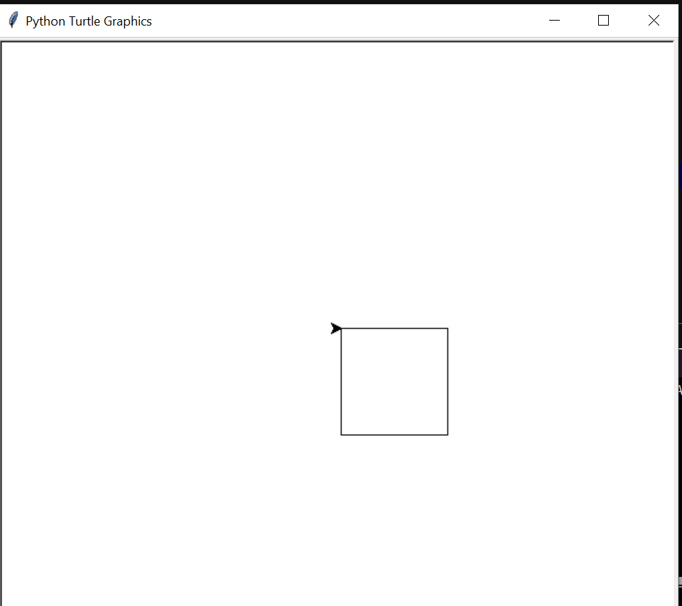
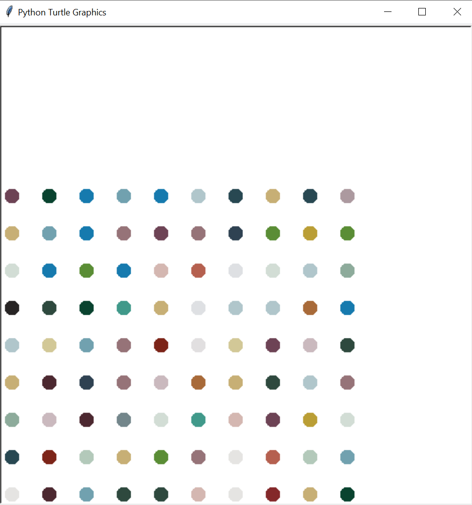
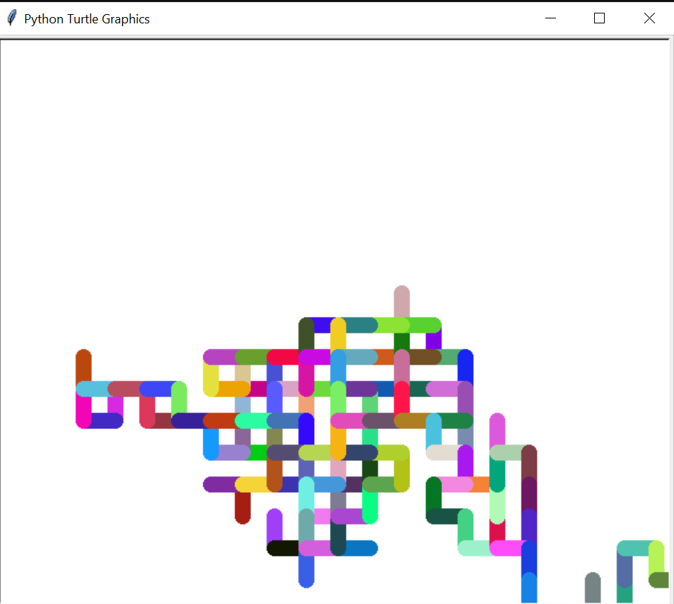
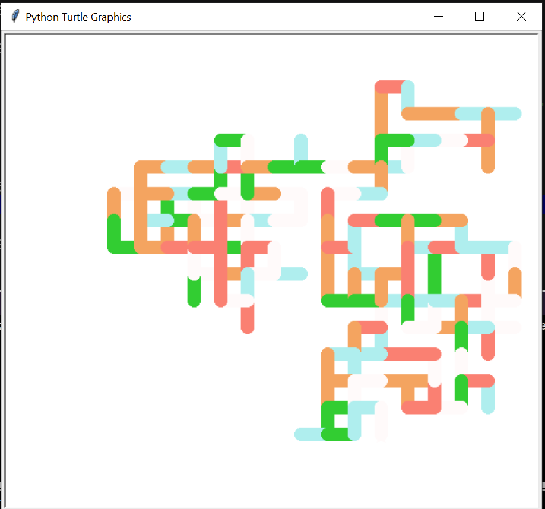

# Codes on Turtle Graphics

_turtle_ is a pre installed library in Python that enables us to create pictures and shapes by providing them with a virtual canvas. The onscreen pen that we use to draw
is called turtle.

## Requirements
### 1. Python Environment:
Use applications like Python IDLE or Jupyter Notebook.
### 2. Python Version:
Ensure you have version 3 of Python.

With the turtle library of Python, we can draw several shapes and figures. Here's two samples we can create with turtles's library.

## 1. Animated Robot
This is a simple figure we can create to understand basics of turtle graphics.  

## 2. Kaleido Spiral
In this, we will draw circles and squares in continuation. Everytime we will change the radius of circle and side dimension of square to make it look like a expanding squares and circles.  

## 3. Draw Shapes
In this, we will draw polygons (from triangles to decagons)in a continuous fashion.

## 4. DrawDashedLine

In this, we will draw a dashed line.

## 5. Draw Spirograph

In this , we will draw a spirograph.

## 6. DrawSquare 

In this , we will draw a square.

## 7. HirstSpotPainting

In this , we will make a model of the famous Hirst spot painting.

## 8. RandomColorWalk

In this, we will generate a random walk using random colors.

## 9. RandomWalk

In this, we will generate a random walk using given colors.

