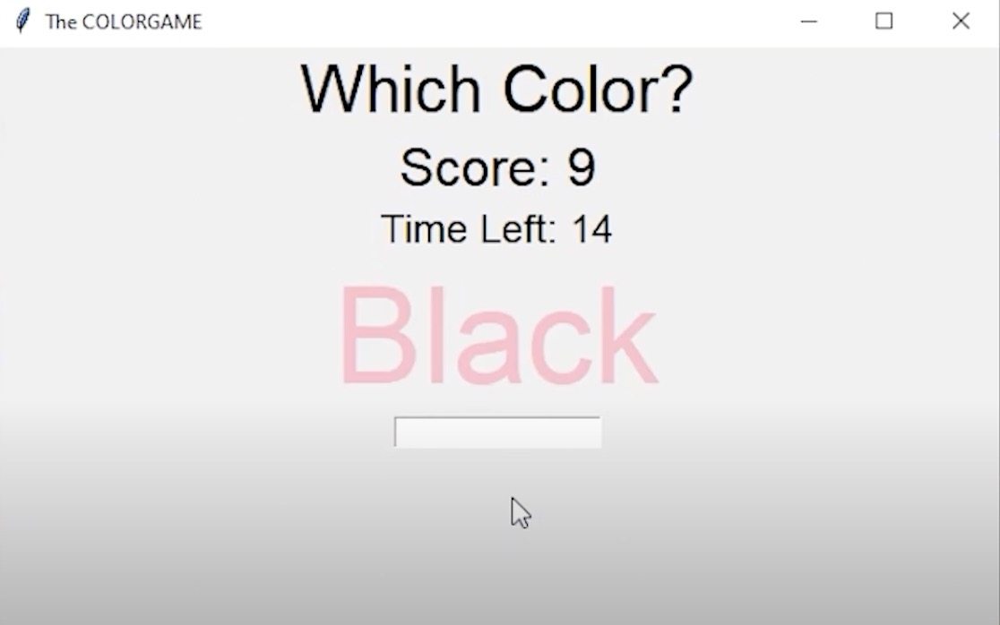
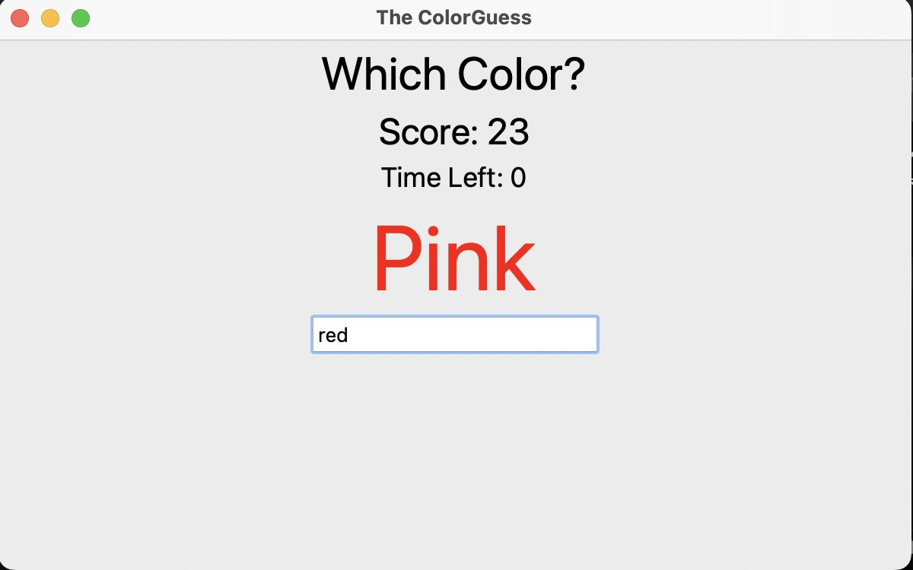

# Color Guessing Game GUI

Using this script you can setup and play a game in whihc you are supposed to guess the color in which the word is displayed in.

## Dependancies

You will use `Tkinter` and `random` python module.

## Setup Instructions

In order to run this script, you need to have any kind of python compiler and interpreter installed on your system. (Ex: VSCode or pycharm)

## Sample Output

On running `Color_guess.py`.

## Author

[Varsha Nimmagadda](https://github.com/varshanim)
