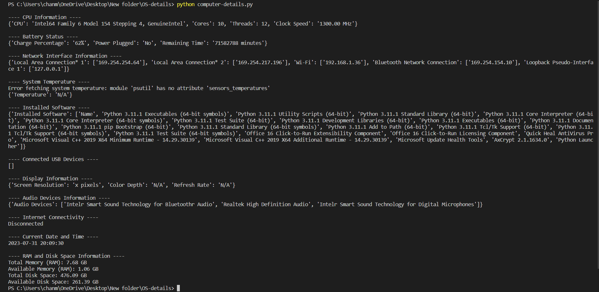

# Computer Details

## 📝 Description
  * This Python script tells all the useful details of a computer (Windows) like
    * CPU information (Processor, No. of Cores etc.)
    * GPU details (GPU name and Version)
    * Battery status (Charge Percentage etc)
    * Network information (Wifi Address)
    * System temperature 
    * List of installed softwares
    * List of connected USB devices
    * List of connected audio devices
    * Internet connectivity
    * Available and used RAM and disk space
<br>
  * The script uses <a href="https://pypi.org/project/psutil/">Psutil</a>, <a href="https://docs.python.org/3/library/socket.html">socket</a> and <a href="https://docs.python.org/3/library/platform.html">Platform</a> libraries for this purpose

<br>

## ⚙️ How To Use

Navigate to the project directory and run the following commands :
```bash
 pip install -r requirements.txt
```
```bash
 python computer-details.py
```

## Output Screenshot



## Author


 * <a href="https://github.com/singhchanmeet"> Chanmeet Singh </a>

