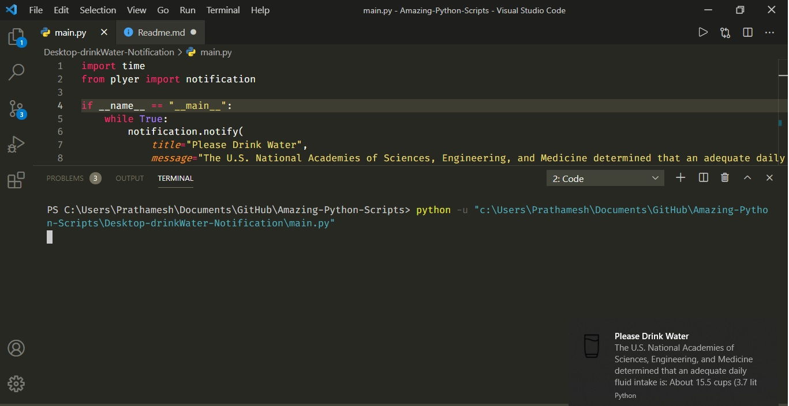

# Desktop Drink Water Notification

This python script helps user to drink more water in a day as per her body needed and also this python script is executed in the background and every 30 minutes it notifies user to drink water.

## How to run this Script

1. Clone this script Using this command `git@github.com:avinashkranjan/Amazing-Python-Scripts.git`
2. You will Need Python to run this Progarm, we will install Python in Step 3.
3. [Download](https://www.python.org/downloads/) Click on this link to install Python.
4. Click on the Extensions and Install Code Runner this will help you to run this Progarm.
5. If you want to run your Progarm in Powershell just type this command `Python .\Desktop-drinkWater-Notification\main.py`
6. If you want to run this script in background just type this command `Pythonw main.py`

## Screenshots

## Author
Prathamesh Borse [viraldevpb](https://github.com/viraldevpb)