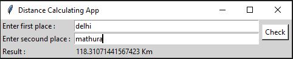

# Quick Start:
- Clone this repository.

      git clone https://github.com/avinashkranjan/Amazing-Python-Scripts.git
      
- Change Directory

      cd .\Distance-Calculator-GUI\
      
- Install requirememnts

      pip install requirements.txt
      
- Run python file

      python main.py
      
# Screenshot

