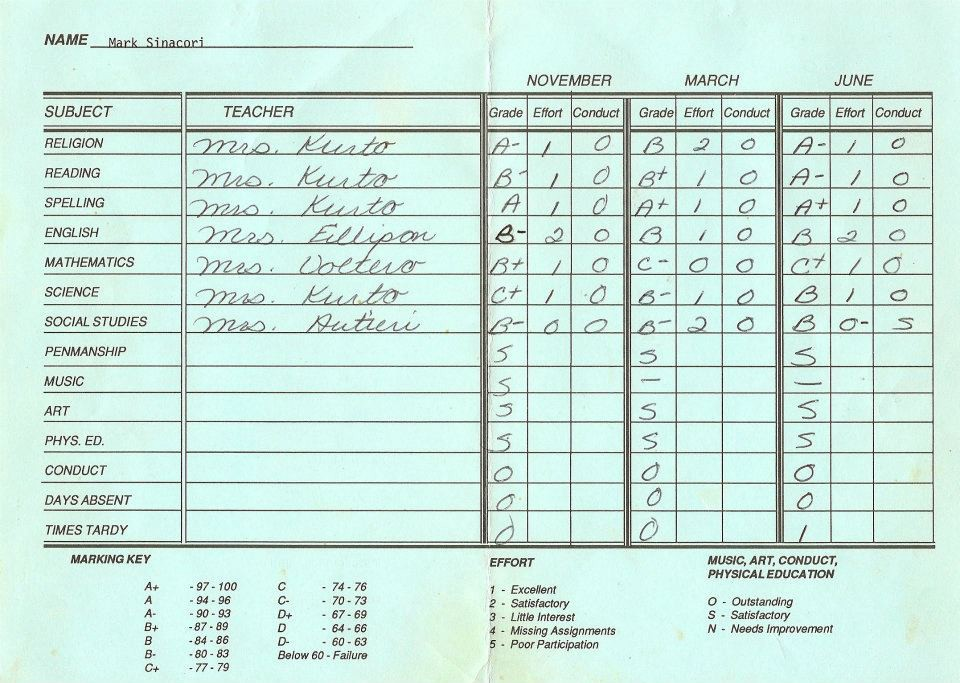
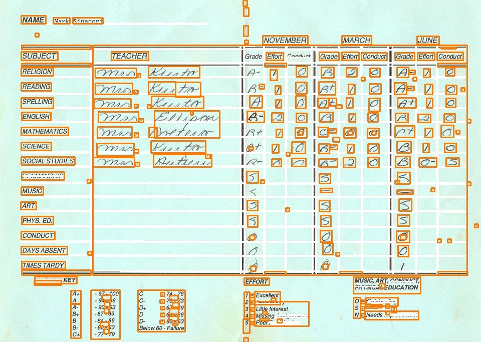

# Document Word Detection

<table>
  <tr>
    <td align="center"><b>Input image</b></td>
     <td align="center"><b>Output image</b></td>
  </tr>
  <tr>
    <td></td>
    <td></td>
  </tr>
 </table>

## Prerequisite

1. **OpenCV :** `$ pip install opencv-python`
2. **Numpy  :** `$ pip install numpy`
3. **Imutils :** `$ pip install imutils` 
