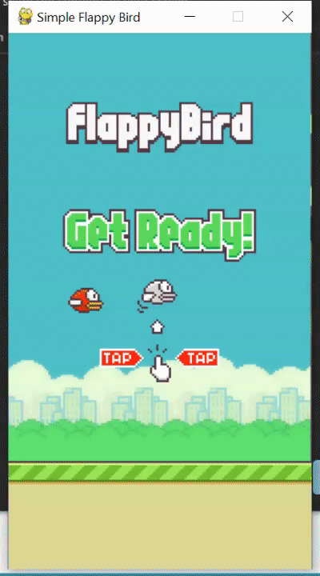

# Flappy-Bird-Game

Flappy Bird is a popular Pygame-based game where players control a bird flying through pipes by tapping the spacebar. The objective is to avoid collisions and navigate through gaps. It's addictive, challenging, and features simple mechanics with a focus on timing and precision.


## Setup instructions

- Clone the repository to your local machine.


- Install the required dependencies using pip.

```
pip install pygame
```

- Run the game script

```
python main.py
```


## Detailed explanation of script, if needed

Explanation:

1. Import the necessary modules and initialize Pygame.

2. Define the dimensions of the game window.

3. Create the game window and set its caption.

4. Load the game assets, including the background image, bird sprite, and pipe image.

5. Define the initial position and speed of the bird.

6. Set the initial position, speed, and gap between the pipes.

7. Initialize the score and create a font object for rendering the score text.

8. Enter the game loop, which runs until the `crashTest` variable is set to `False`.

9. Handle Pygame events, such as quitting the game or triggering the bird to jump when the spacebar is pressed.

10. Update the bird's position by adjusting its speed based on gravity.

11. Update the pipe's position by moving it to the left, and reset its position when it goes off the screen.

12. Check for collisions between the bird and the pipes. If a collision occurs, either end the game or increase the score.

13. Draw the background, bird, pipe, and score text on the game window.

14. Update the display to show the changes.

15. When the game loop ends, quit Py

## Output



## Author(s)

#### Avantika Pandey
- LinkedIN: https://www.linkedin.com/in/avantika-pandey-2759941ab 
- GitHub: https://github.com/codewithavantika

