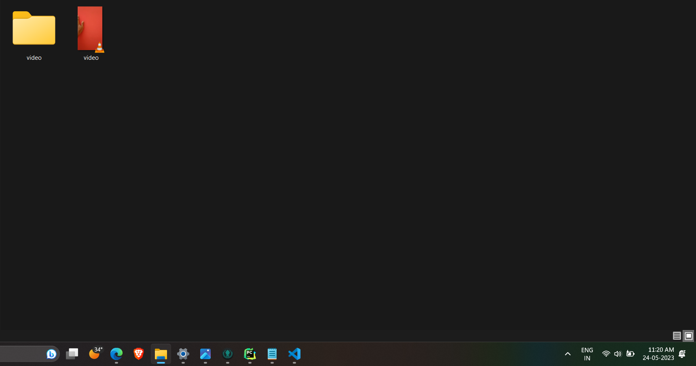
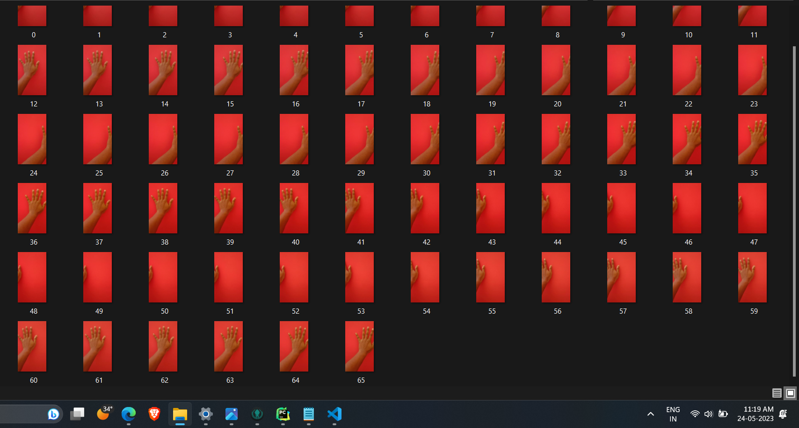

# Framext
A python script that extracts frames from video

## Setup instructions

To use this script, get a copy of the script into your system and pass in the required arguments

## Detailed explanation of script, if needed

The Script takes the following Arguments:

~~~

python framext.py -h

usage: Frame Extractor [-h] -i VIDEO_FILE -o OUTPUT_DIR [-s SAMPLE_RATE]

options:
  -h, --help            show this help message and exit
  -i VIDEO_FILE, --video_file VIDEO_FILE
                        Location of video file
  -o OUTPUT_DIR, --output_dir OUTPUT_DIR
                        Output directory to store frames
~~~

The script works by extracting the FPS cap from the metadata of the video file and the length of the video. Then it uses OpenCV and counter to extract frames using the FPSCap and length of video.

## Output
The supplied video file and the created folder:

The Frames extracted from the video

## Author

Swastik Gorai

## Disclaimers, if any

This script has no assoicated Disclaimers
