# Google Meet Scheduler

The script [here](script.py) allows you to schedule a [google meeting](https://meet.google.com/) with multiple guests using [python](https://www.python.org/). You just need to provide the topic, time and list of email ids of the guests for the meeting and the [script](script.py) will handle the rest of the work.

## Setup

#### Step 1. You'll need to download a `credentials.json` file.

- Go to [https://developers.google.com/calendar/quickstart/python](https://developers.google.com/calendar/quickstart/python).

- Click the `Enable the Google Calendar API` button as shown below.

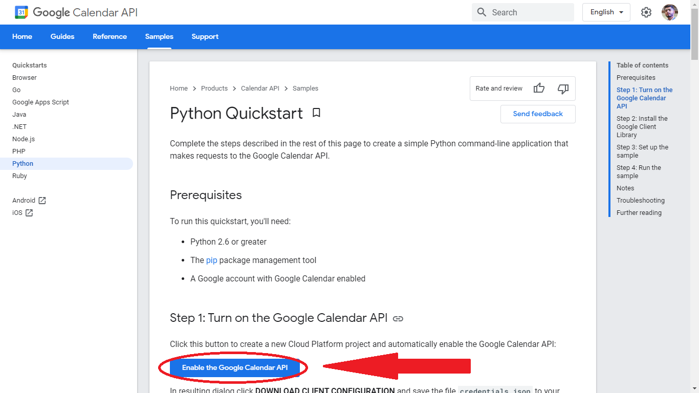

- Click Next on each upcoming tab, **you don't need to change anything**.
- Download the `credentials.json` file as shown below.

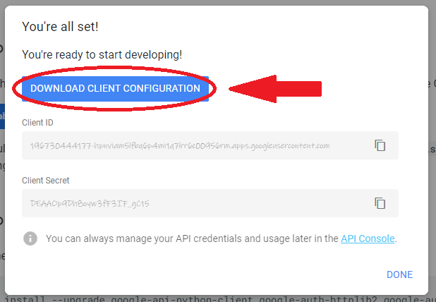

- Move this file to the folder where your `script.py` resides.

#### Step 2. Install all the dependencies listed in the [`requirements.txt`](requirements.txt)
- Just Run `pip install -r requirements.txt`
- If facing any issue installing any package, just google it :)

#### Step 3. Now if you run the script for the first time then you'll be requested to grant some permissions.
- First of all you'll need to choose the google acount you want to use.

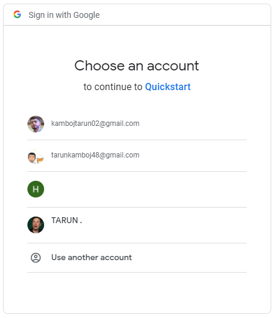

- Now you may see a message like this in your browser.

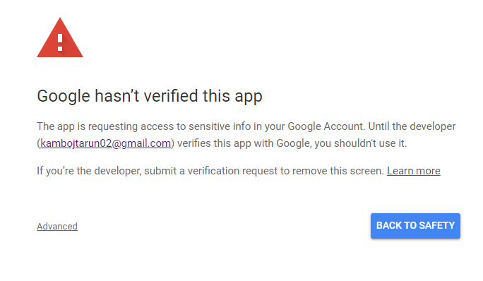

- You don't need to panic, just click `Advanced`.

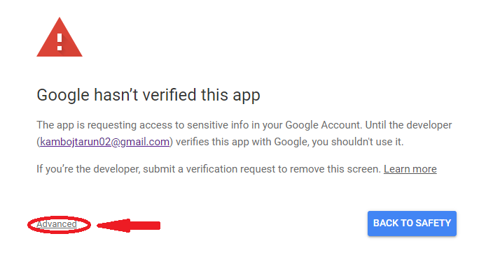

- Click on `Go to QuickStart` as shown below.

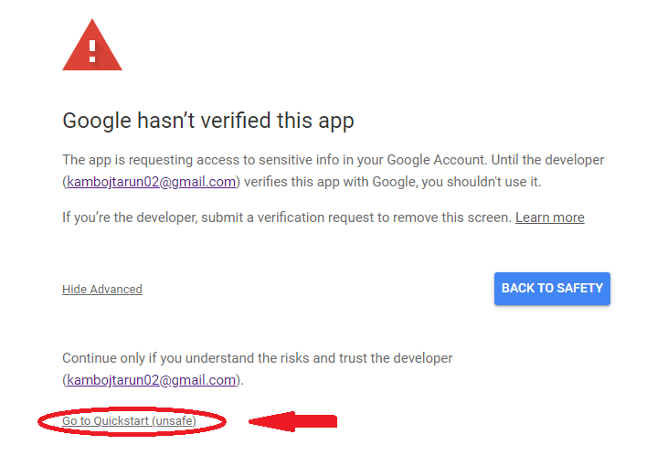

- Grant the permissions by clicking `Allow`.

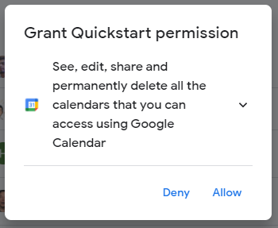

- And finally, confirm your choices by clicking `Allow` again.

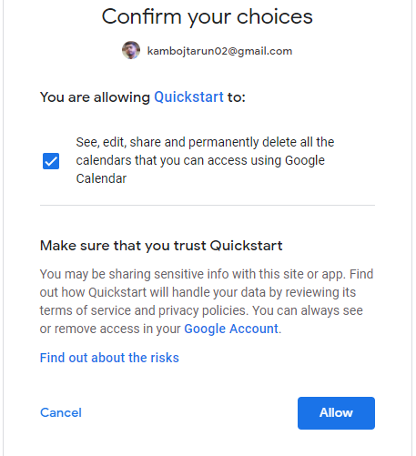

#### Step 4. You are all set now, just run the script. Hurray!!
- If still facing any issue, then contact [here](https://github.com/Tarun-Kamboj).

## Output

- Now if you run the script and provide the details, a meeting will be set between you and your guests.
- The details can be retreived from the script itself. The script prints the details of the meeting as you can see below.

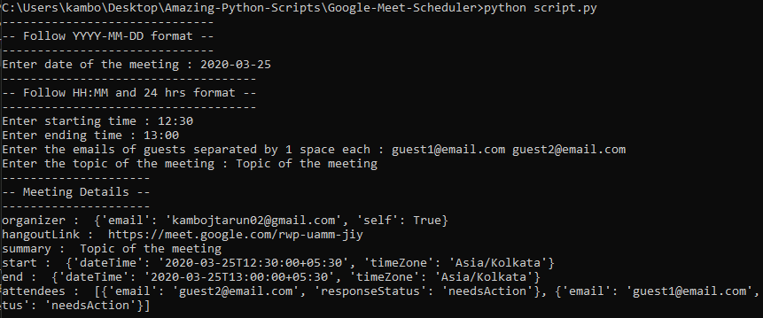

- The script also sets the event in your google calender.

| 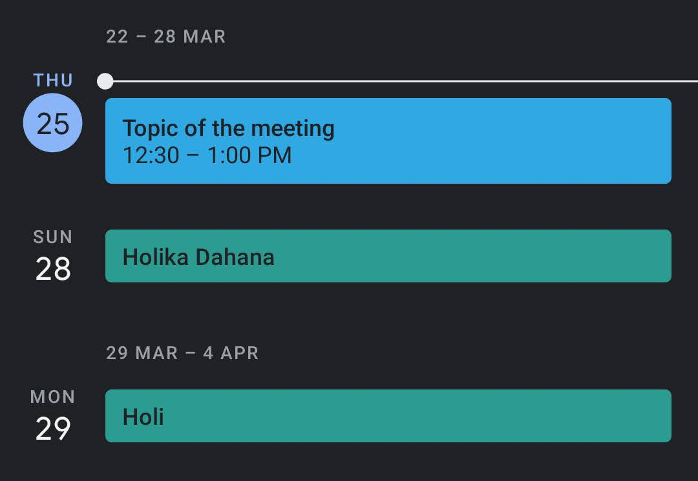 |  |
|--|--|

- The script also sends the emails to the guests.
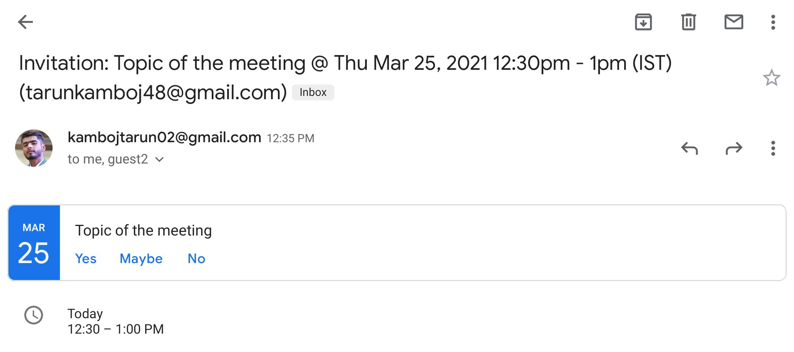

## Author
### Contributed by [Tarun Kamboj](https://github.com/Tarun-Kamboj)
### Thanks for reading :)