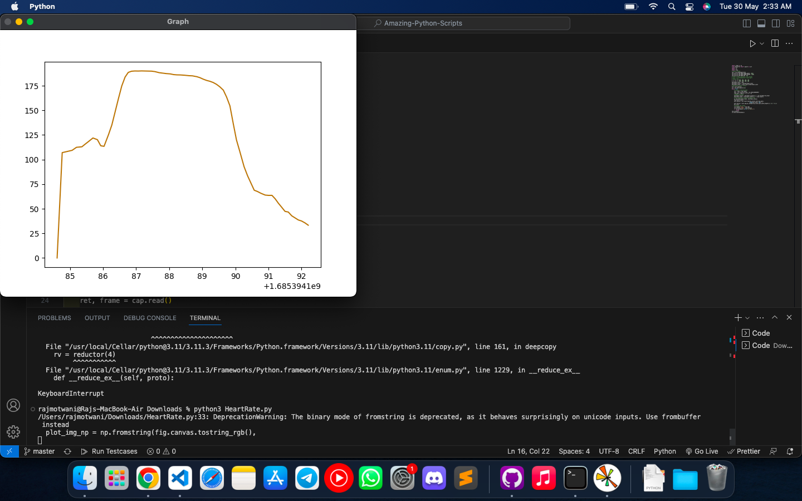

# **Heart Rate Detection**

- Heart Rate detection using the eye's movement, OpenCV and various algorithms.

# Requirements

```
- pip install -U pip
- pip install -U matplotlib
- pip install opencv-python
- pip install numpy
```

# Sample Image-



# Video-

[](./SampleVideo-HeartRate-Detection-Raj%20Motwani.mp4)

# Author -

- **_Raj Motwani_**

  - <a href="https://www.linkedin.com/in/raj-motwani-978143204/" target="_blank">LinkedIn</a>

  - <a href="https://github.com/raj3000k" target="_blank">GitHub</a>
