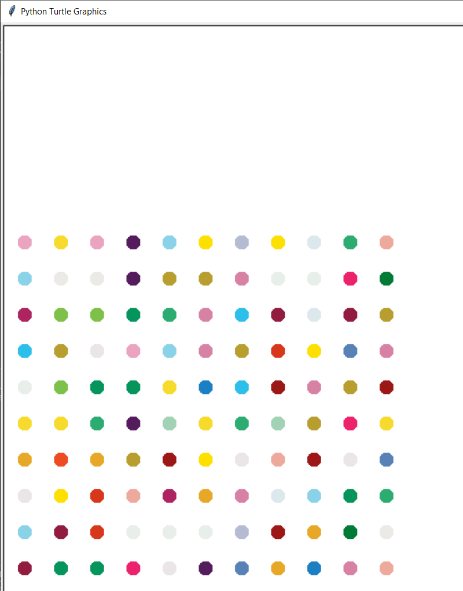

# Package/Script Name

- Turtle - for graphics.
- Colorgram - for extracting colors.

## Setup instructions

To run Python scripts with the python command, you need to open a command-line and type in the word python, or python3 if you have both versions, followed by the path to your script, just like this:
python HirstSpotPainting.py
## Detailed explanation of script, if needed

The code basically creates equally spaced dots using turtle module.It is a model of Hirst's spot painting.
Click [here](https://www.damienhirst.com/texts1/series/spots) to know more.

## Output

## Author(s)

Anushka Pathak

## Disclaimers, if any

No, as such.