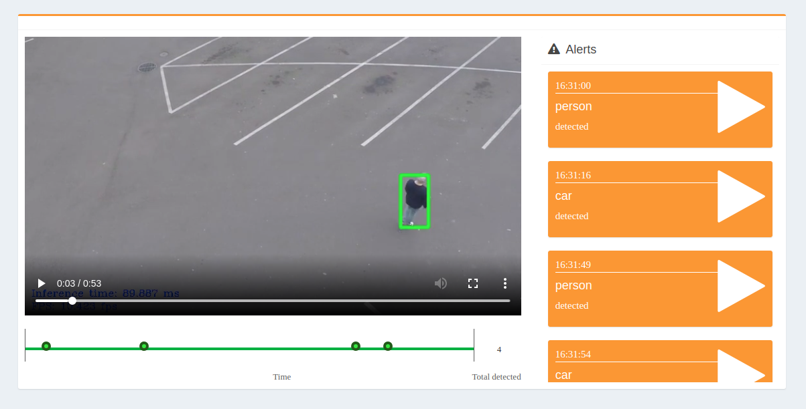
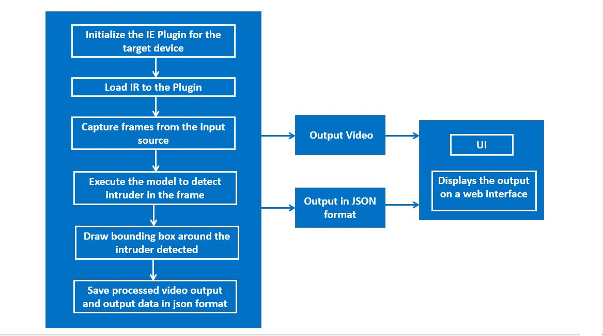
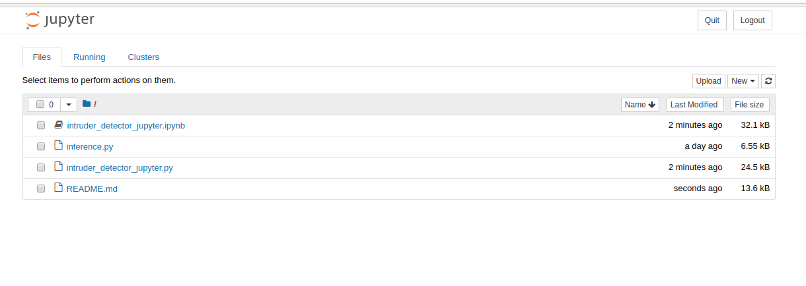
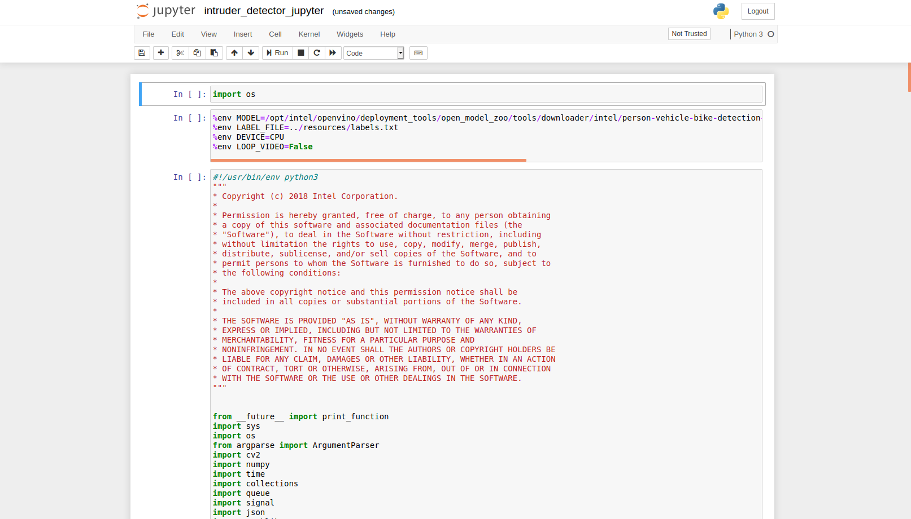

# Intruder Detector

| Details               |                   |
| --------------------- | ----------------- |
| Target OS:            | Ubuntu* 18.04 LTS |
| Programming Language: | Python* 3.5       |
| Time to Complete:     | 45 min            |



**Figure 1:** An application capable of detecting any number of objects from a video input.

## What it does
This reference implementation detect the objects in a designated area. It gives the number of objects in the frame, total count and also record the alerts of the objects present in the frame. The application is capable of processing the inputs from multiple cameras and video files.

## Requirements

### Hardware

- 6th to 8th generation Intel® Core™ processors with Iris® Pro graphics or Intel® HD Graphics

### Software

- [Ubuntu\* 18.04 LTS](http://releases.ubuntu.com/18.04/)<br>
  NOTE: Use kernel versions 4.14+ with this software.<br> 
  Determine the kernel version with the below uname command. 

  ```
   uname -a
  ```

- Intel® Distribution of OpenVINO™ toolkit 2020 R3 release
- Jupyter* Notebook v5.7.0

## How It works

The application uses the Inference Engine included in the Intel® Distribution of OpenVINO™ toolkit. A trained neural network detects objects within a designated area by displaying a green bounding box over them and registers them in a logging system.



**Figure 2:**  Architectural Diagram

## Setup

### Get the code

Steps to clone the reference implementation: (intruder-detector)
```
sudo apt-get update && sudo apt-get install git
git clone https://gitlab.devtools.intel.com/reference-implementations/intruder-detector-python.git
```
### Install Intel® Distribution of OpenVINO™ toolkit

Refer to [Install Intel® Distribution of OpenVINO™ toolkit for Linux*](https://software.intel.com/en-us/articles/OpenVINO-Install-Linux) to learn how to install and configure the toolkit.

Install the OpenCL™ Runtime Package to run inference on the GPU, as shown in the instructions below. It is not mandatory for CPU inference.

### Other dependencies
#### FFmpeg* 
FFmpeg is a free and open-source project capable of recording, converting and streaming digital audio and video in various formats. It can be used to do most of our multimedia tasks quickly and easily say, audio compression, audio/video format conversion, extract images from a video and a lot more.

### Which model to use

The application uses the [person-vehicle-bike-detection-crossroad-0078](https://docs.openvinotoolkit.org/2020.3/_models_intel_person_vehicle_bike_detection_crossroad_0078_description_person_vehicle_bike_detection_crossroad_0078.html) Intel® model, that can be accessed using the **model downloader**. The **model downloader** downloads the __.xml__ and __.bin__ files that will be used by the application.

The application also works with any object-detection model, provided it has the same input and output format of the SSD model.
The model can be any object detection model:
- Downloaded using the **model downloader**, provided by Intel® Distribution of OpenVINO™ toolkit.

- Built by the user.<br>

To install the dependencies of the RI and to download the **person-vehicle-bike-detection-crossroad-0078** Intel® model, run the following command:

  ```
  cd <path_to_the_intruder-detector-python_directory>
  ./setup.sh
  ```
The model will be downloaded inside the following directory:

    /opt/intel/openvino/deployment_tools/open_model_zoo/tools/downloader/intel/person-vehicle-bike-detection-crossroad-0078/

### The Labels File

In order to work, this application requires a _labels_ file associated with the model being used for detection.  

All detection models work with integer labels, not string labels (e.g., For the **person-vehicle-bike-detection-crossroad-0078** model, the number 1 represents the class "person"). Each model must have a _labels_ file, which associates an integer, the label the algorithm detects, with a string denoting the human-readable label.

The _labels_ file is a text file containing all the classes/labels that the model can recognize, in the order that it was trained to recognize them (one class per line).

For the **person-vehicle-bike-detection-crossroad-0078** model, find the class file _labels.txt_ in the resources folder.

### The Config File

The _resources/config.json_ contains the path to the videos that will be used by the application, followed by the labels to be detected on those videos. All labels (intruders) defined will be detected on all videos.   

The _config.json_ file is of the form name/value pair, `video: <path/to/video>` and `label: <label>`   
The labels used in the _config.json_ file must coincide with the labels from the _labels.txt_ file.

Example of the _config.json_ file:

```
{

    "inputs": [
	    {
            "video": ["videos/video1.mp4","videos/video2.avi"],
            "label": [ "person", "bicycle"]
        }
    ]
}
```

The application can use any number of videos for detection, but the more videos the application uses in parallel, the more the frame rate of each video scales down. This can be solved by adding more computation power to the machine on which the application is running.

### Which Input video to use

The application works with any input video. Find sample videos for object detection [here](https://github.com/intel-iot-devkit/sample-videos/).  

For first-use, we recommend using the [person-bicycle-car-detection]( https://github.com/intel-iot-devkit/sample-videos/blob/master/person-bicycle-car-detection.mp4) video.The video is automatically downloaded to the `resources/` folder.
For example: <br>
The config.json would be:

```
{

    "inputs": [
	    {
            "video": "sample-videos/person-bicycle-car-detection.mp4",
            "label": [ "person", "bicycle", "car"]
        }
    ]
}
```
To use any other video, specify the path in config.json file

### Using the Camera instead of video

Replace the path/to/video in the _resources/config.json_  file with the camera ID, where the ID is taken from the video device (the number X in /dev/videoX).   

For example:

```
{

    "inputs": [
	    {
            "video": "0",
            "label": [ "person", "bicycle", "car"]
        }
    ]
}
```

On Ubuntu, list all available video devices with the following command:

```
ls /dev/video*
```
## Setup the environment
You must configure the environment to use the Intel® Distribution of OpenVINO™ toolkit one time per session by running the following command:

    source /opt/intel/openvino/bin/setupvars.sh
    
__Note__: This command needs to be executed only once in the terminal where the application will be executed. If the terminal is closed, the command needs to be executed again.
    
### Run the Application on Jupyter*

* Go to the _intruder-detector-python directory_ and open the Jupyter notebook by running the following commands:

  ```
  cd <path_to_the_intruder-detector-python_directory>/Jupyter
  jupyter notebook
  ```
<!--
  **NOTE**:
    Before running the application on the FPGA, set the environment variables and  program the AOCX (bitstream) file.<br>

    Set the Board Environment Variable to the proper directory:

    ```
    export AOCL_BOARD_PACKAGE_ROOT=/opt/intel/openvino/bitstreams/a10_vision_design_sg<#>_bitstreams/BSP/a10_1150_sg<#>
    ```
    **NOTE**: If you do not know which version of the board you have, please refer to the product label on the fan cover side or by the product SKU: Mustang-F100-A10-R10 => SG1; Mustang-F100-A10E-R10 => SG2 <br>

    Set the Board Environment Variable to the proper directory: 
    ```
    export QUARTUS_ROOTDIR=/home/<user>/intelFPGA/18.1/qprogrammer
    ```
    Set the remaining environment variables:
    ```
    export PATH=$PATH:/opt/altera/aocl-pro-rte/aclrte-linux64/bin:/opt/altera/aocl-pro-rte/aclrte-linux64/host/linux64/bin:/home/<user>/intelFPGA/18.1/qprogrammer/bin
    export INTELFPGAOCLSDKROOT=/opt/altera/aocl-pro-rte/aclrte-linux64
    export LD_LIBRARY_PATH=$LD_LIBRARY_PATH:$AOCL_BOARD_PACKAGE_ROOT/linux64/lib
    export CL_CONTEXT_COMPILER_MODE_INTELFPGA=3
    source /opt/altera/aocl-pro-rte/aclrte-linux64/init_opencl.sh
    ```
    **NOTE**: It is recommended to create your own script for your system to aid in setting up these environment variables. It will be run each time you need a new terminal or restart your system. 

    The bitstreams for HDDL-F can be found under the `/opt/intel/openvino/bitstreams/a10_vision_design_sg<#>_bitstreams/` directory.<br><br>To program the bitstream use the below command:<br>
    ```
    aocl program acl0 /opt/intel/openvino/bitstreams/a10_vision_design_sg<#>_bitstreams/2019R3_PV_PL1_FP11_RMNet.aocx
    ```

    For more information on programming the bitstreams, please refer to [OpenVINO-Install-Linux-FPGA](https://software.intel.com/en-us/articles/OpenVINO-Install-Linux-FPGA#inpage-nav-11)
-->

**Follow the steps below :**



**Figure 3:** Jupyter Window

1. Click on **New** button present on the right side of the Jupyter window (see Figure 3).
2. Click on **Python 3** option from the drop down list.
3. In the first cell, type **import os** and press **Shift+Enter**.
4. Export the following environment variables in second cell and press **Shift+Enter**:<br>
   ```
   %env MODEL=/opt/intel/openvino/deployment_tools/open_model_zoo/tools/downloader/intel/person-vehicle-bike-detection-crossroad-0078/FP32/person-vehicle-bike-detection-crossroad-0078.xml
   %env LABEL_FILE=../resources/labels.txt
   %env DEVICE=CPU
   %env LOOP_VIDEO=False
   ```
To run the application on sync mode, export the environment variable **%env FLAG = sync**. By default, the application runs on async mode.<br>
5. Copy the code of **intruder_detector_jupyter.py** and paste it in the third cell of jupyter.<br>
6. Click on **Kernel** present in the menu and then select **Restart & Run All** from the drop down list.<br>
7. On the pop-up window, click on **Restart and Run All Cells**.

- Alternatively, code can be run in the following way:

  - Click on **intruder_detector_jupyter.ipynb** file in the jupyter notebook window.

  - Click on **Kernel** present in the menu and then select **Restart & Run All** from the drop down list.

  - On the pop-up window, click on **Restart and Run All Cells**.

    

**Figure 4:** Jupyter Notebook intruder_detector_jupyter.ipynb

**Note:**<br>

1. To run the application on **GPU**: 
   - With the floating point precision 32 (FP32), change the **%env DEVICE = CPU** to **%env DEVICE = GPU**.
     **FP32**: FP32 is single-precision floating-point arithmetic uses 32 bits to represent numbers. 8 bits for the magnitude and 23 bits for the precision. For more information, [click here](https://en.wikipedia.org/wiki/Single-precision_floating-point_format)<br>
   - With the **floating point precision 16 (FP16)**,  change the environment variables as given below:<br>
     ```
     %env DEVICE = GPU
     %env MODEL=/opt/intel/openvino/deployment_tools/open_model_zoo/tools/downloader/intel/person-vehicle-bike-detection-crossroad-0078/FP16/person-vehicle-bike-detection-crossroad-0078.xml
     ```
     **FP16**: FP16 is half-precision floating-point arithmetic uses 16 bits. 5 bits for the magnitude and 10 bits for the precision. For more information, [click here](https://en.wikipedia.org/wiki/Half-precision_floating-point_format)

   
2. To run the application on **Intel® Neural Compute Stick**:
   - Change the **%env DEVICE = CPU** to **%env DEVICE = MYRIAD**.  
   - The Intel® Neural Compute Stick can only run FP16 models. Change the environment variable for the model as shown below. <br>
     **%env MODEL=/opt/intel/openvino/deployment_tools/open_model_zoo/tools/downloader/intel/person-vehicle-bike-detection-crossroad-0078/FP16/person-vehicle-bike-detection-crossroad-0078.xml**.
   **Note:** The Intel® Neural Compute Stick can only run FP16 models. The model that is passed to the application must be of data type FP16.
   
3. To run the application on **Intel® Movidius™ VPU**:
    - Change the **%env DEVICE = CPU** to **%env DEVICE = HDDL**.
    - The Intel® Movidius™ VPU can only run FP16 models. Change the environment variable for the model as shown below  and the model that is passed to the application must be of data type FP16. <br>
    **%env MODEL=/opt/intel/openvino/deployment_tools/open_model_zoo/tools/downloader/intel/person-vehicle-bike-detection-crossroad-0078/FP16/person-vehicle-bike-detection-crossroad-0078.xml**.


<!--
4. To run the application on **Intel® Arria® 10 FPGA**:
    - Change the **%env DEVICE = CPU** to **%env DEVICE = HETERO:FPGA,CPU**.
    - With the **floating point precision 16 (FP16)**, change the path of the model in the environment variable **MODEL** as given below:<br>
    **%env MODEL=/opt/intel/openvino/deployment_tools/open_model_zoo/tools/downloader/intel/person-vehicle-bike-detection-crossroad-0078/FP16/person-vehicle-bike-detection-crossroad-0078.xml**.
-->

5. By default, the application reads the input videos only once.  To continuously loop the videos, change the value of **LOOP_VIDEO** in the environmental variable as given below.<br>
   - Change **%env LOOP_VIDEO=False** to  **%env LOOP_VIDEO=True**.<br>

6. To run the application on multiple devices: <br>
   For example:
      * Change the **%env DEVICE = CPU** to **%env DEVICE = MULTI:CPU,GPU,MYRIAD**
      * With the **floating point precision 16 (FP16)**, change the path of the model in the environment variable **MODEL** as given below: <br>
        **%env MODEL=/opt/intel/openvino/deployment_tools/open_model_zoo/tools/downloader/intel/person-vehicle-bike-detection-crossroad-0078/FP16/person-vehicle-bike-detection-crossroad-0078.xml**.


## Use the Browser UI

The default application uses a simple user interface created with OpenCV. A web based UI, with more features is also provided with this application.
To run the application with UI mode on, change the environment variable `UI` in second cell to `true` i.e 
```
%env UI = true
```
Follow the readme provided [here](../UI) to run the web based UI.
