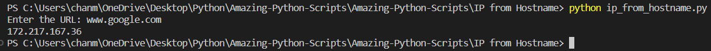

# IP from Hostname

## 📝 Description
  * This Python script takes a URL as an input and returns the corresponding IP address
  * The script uses <a href="https://docs.python.org/3/library/socket.html">socket library</a> for this purpose

<br>

## ⚙️ How To Use

Navigate to the project directory and run the following command :
```bash
 python ip_from_hostname.py
```

## Output Screenshot



## Author


 * <a href="https://github.com/singhchanmeet"> Chanmeet Singh </a>


