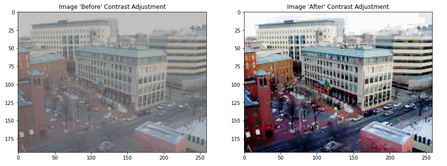

# Image Contrast Adjusting Filter

Images captured in dim light mostly not have a much better contrast so an (Image Contrast Adjusting filter) filter helps accordingly to adjusts and increase its contrast and hence we are having a better version of the image. Hence this filter helps to get a high contrast image.

## Libraries used
Firstly import the following python libraries 
* Matplotlib,
* NumPy
* PIL
Save the image and your code in the same folder
Run the python code

## Detailed explanation of the method used

* Imported the required libraries ( Numpy, Matplotlib, PIL, IPython.display)
* Read the input image using Image from PIL library
* Converted the image into an array and then flatten it making it a 1d array
* Count the number of occurance of each pixel in the image and hence getting an array of frequency count of each pixels
* Then making cdf from the frequency count list 
* Normalizing the cdf
* Converting the cdf shape into the shape of given image
* Finally converted the image into contrast adjusted image

## Comparison With The Result 

## Author(s)
[Akriti](https://github.com/A-kriti)
