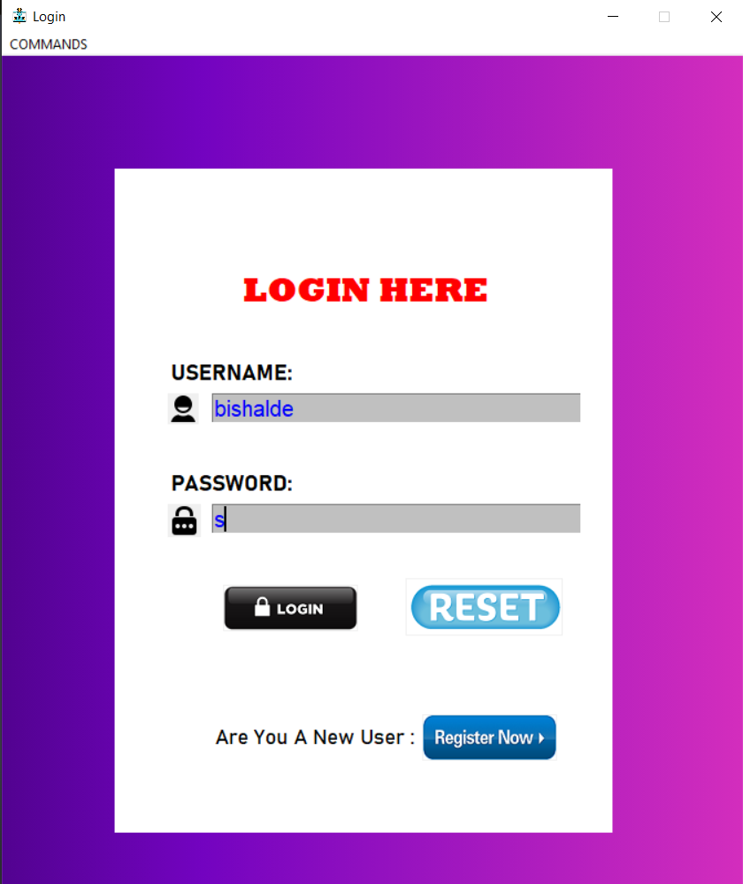
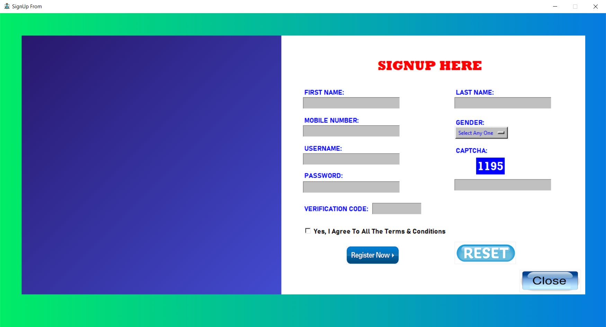

# Python GUI For Login And Signup

This repository contains a Python Graphical User Interface (GUI) application that allows users to login and signup using the pickle module for data storage. The GUI provides an intuitive interface for users to enter their credentials and perform login or signup operations securely.

## Made On

[](https://forthebadge.com)

## Install Modules

```bash
  pip install requirements.txt
```

## Screenshots






## 🔗 Links

[](https://bishalde.vercel.app)
[](https://www.linkedin.com/in/bishalde)
[](https://instagram.com/bishal_de)
