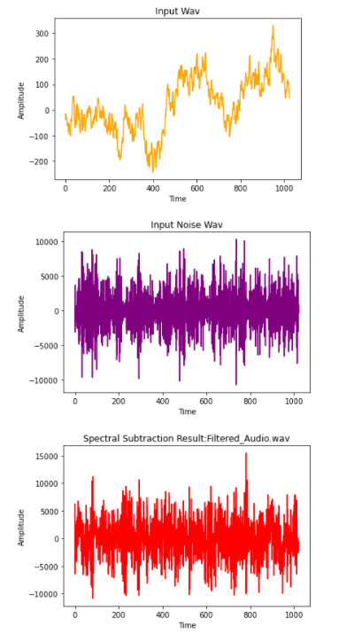

# Mini Audacity
Implementing a feature that helps to filter an audio file by reducing the background noise similar to "Audacity".

## Libraries used
Firstly import the following python libraries 
* scipy
* NumPy
* librosa
* scipy.io.wavfile
* Matplotlib
* scipy.io

Save the audio files and your code in the same folder

Run the python code

## Detailed explanation of method used for "Mini Audacity" 

* Imported the required libraries (scipy, NumPy, librosa, scipy.io.wavfile, Matplotlib, scipy.io)
* Read the input audio file using librosa library
* Converting the audio file into an array containg all the information of the given audio file.
* Calculating short time fourier transform of both pure audio file as well as noisy audio file 
* Subtracting the noise spectral mean from input spectral, and istft (Inverse Short-Time Fourier Transform)
* Applying phase transformation to convert it into time domain signal
* Finally getting an audio file with reduction in the background noise at a much higher extent

## Output

## Author(s)

Akriti 

