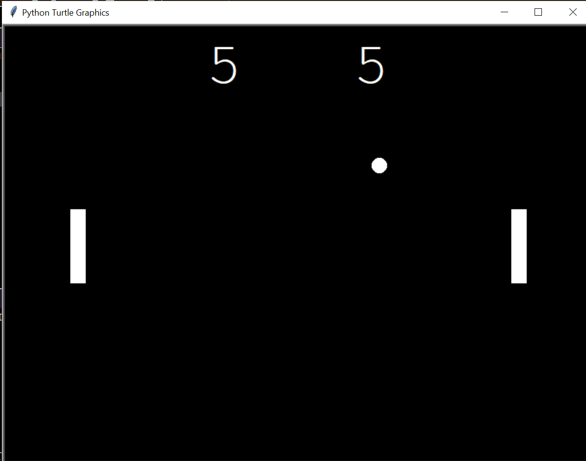

# Package/Script Name

pong.py : set up the game 
paddle.py : set up paddles 
ball.py : manage ball 
scoreboard.py : show scores 

## Setup instructions
python file.py

## Detailed explanation of script, if needed

A "tennis like" game features two paddles and a ball, the goal is to defeat your opponent by being the first one to gain 10 points, a player gets a point once the opponent misses a ball.
## Output

## Author(s)

[Anushka Pathak](https://github.com/anumshka)

