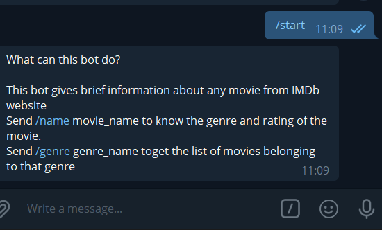
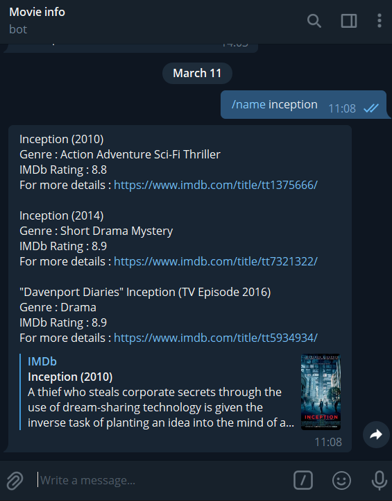
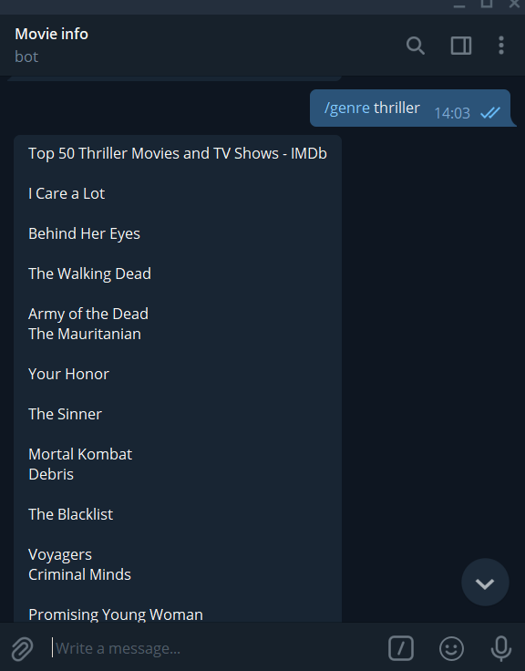

# Movie Info Telegram Bot

1. Create a bot in telegram:

       1. Go to @BotFather and click /start and type /newbot and give it a name. 
       2. Choose a username and get the token 
       3. Place the token in "YOUR-TOKEN" place in the code

2. Install required packages:

       pip install requests
       pip install python-telegram-bot
3. Run the python code to start the bot

4. Type /start command to start conversation with the chatbot.

5. Type /name <movie_name> to get the genre and Rating of the movie. The bot replies with atmost three results.
6. Type /genre \<genre> to get a list of movies and TV shows belonging to that genres

## Output

### /start command

  

### /name command

### /genre command

## Author

Aishwarya  
[@aish2002](https://github.com/aish2002)
