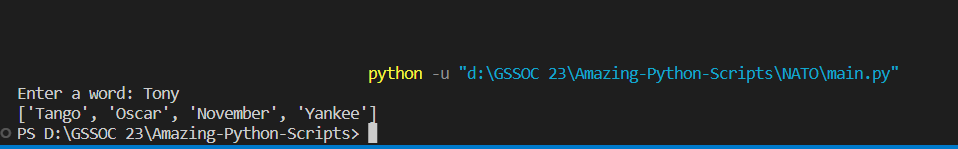

# Package/Script Name

Short description of package/script

-You enter a name and returns in form of NATO Phonetic Alphabets

## Setup instructions

No extra library required

## Detailed explanation of script, if needed

## Output

## Author(s)

Harsh Pandey

## Disclaimers, if any

Use it just for fun