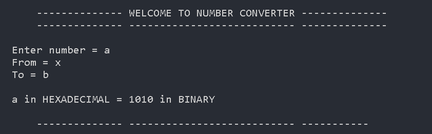
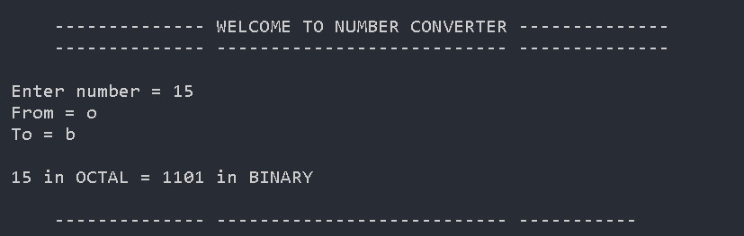
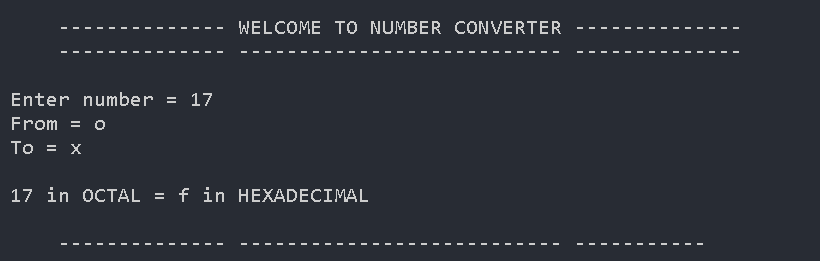
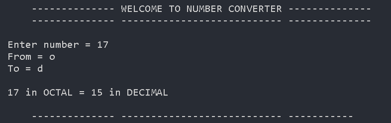

# Number Conversion

Short description of package/script

- With this python script one can convert a user input number from one base to other.By Default conversion takes place from decimal to binary.Specify the FROM and TO parameters from the following:
    -d->decimal,
    -b->binary,
    -x->hexadecimal,
    -o->octal

## Setup instructions

- run the converter_script.py file in terminal

## Output

Display images/gifs/videos of output/result of your script so that users can visualize it

## Author(s)

- Samarth Chaplot

