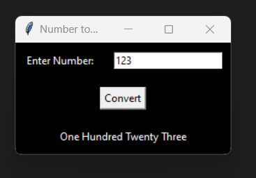
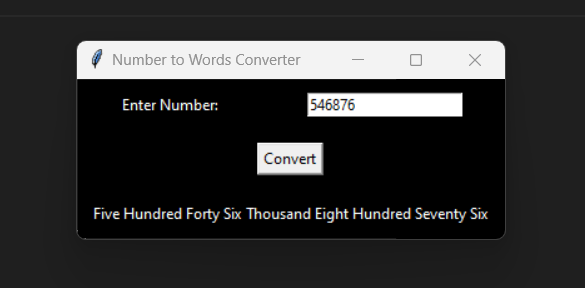
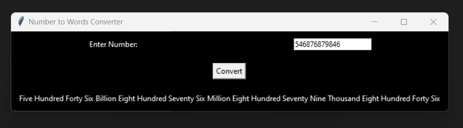
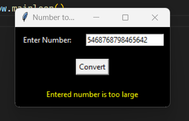
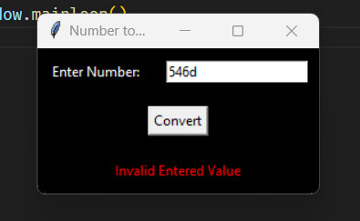
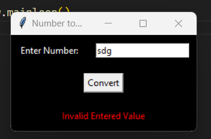

# Number to Words Convertor

_______________________________________________________________________

## What is it

This program will convert the entered number into international system of numbering.
This program can convert the numbers upto the range of Trillions.

## TechStack

1. Module Used:


        - tkinter

        This module is used to create the GUI of the progam

        You can install it using the below command :

        ```pip install tk```

## Output









## Author

[Avdhesh Varshney](https://github.com/Avdhesh-Varshney)

