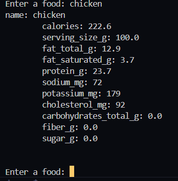
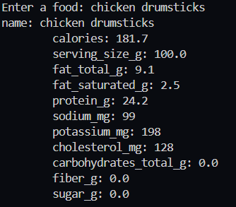
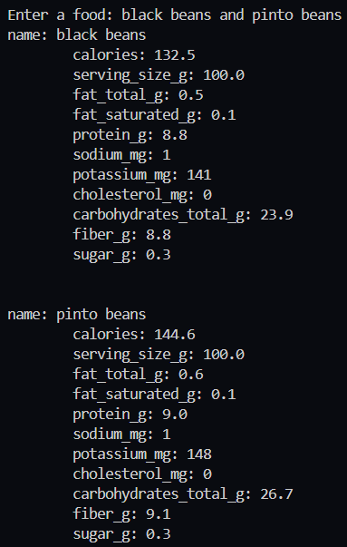

# Nutritional Facts
Use this script to retrieve the nutritional information of your favorite food items!

## Setup instructions
### Pckages
- Install all required packages using this `pip install -r requirements.txt`.

### API Key
- Before you run the script you will need to recieve a CalorieNinja API Key.
- To do this got to the [CalorieNinja](https://calorieninjas.com/register) website and create an account, which is completely free.
- Once you have made an account you can recieve a free API-Key by navigating through the tabs and generating one.
- Once you have recieved an API Key you may paste it into the code here `headers={"X-API-key": "YOUR-API-KEY"}`.

## Output
Here is an example use case of me using the script to find out the nutrition of chicken.

You can also be more specific

You can also do multiple food items at once

## Author(s)

Adithya Bollu

