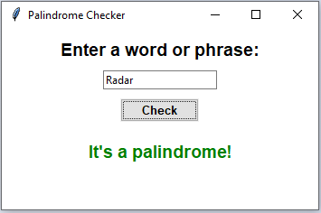

# **Palindrome Checker**
This is a Python program that checks whether a given word or phrase is a palindrome or not. It provides a graphical user interface (GUI) using the Tkinter library.

## **Requirements**
- Tkinter library

## **How to Run**
1. Install the Tkinter library if it is not already installed by using
``` 
  pip install tkinter
```
2. Open a terminal or command prompt and navigate to the directory where the file is saved.

3. Run the code.The GUI window will appear.

6. Enter a word or phrase in the input field.

5. Click the "Check" button to check if it is a palindrome or not.

6. The program will display the result in the output label below the button.

## **Output**


## **Author**
[Abhishek-Rajput-81](https://github.com/Abhishek-Rajput-81)
