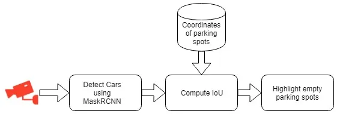

# OVERVIEW
Finding parking space for your vehicle is a major problem in big cities. The rise of car ownership has created an imbalance between parking demand and supply. In the current situation, a parking management system that can track parking spots has become a necessity for all major cities. The system has to be scalable, efficient, reliable, and affordable at the same time. In recent years, the advances in deep learning powered computer vision algorithms have shown very promising results in a variety of tasks. Similar techniques can be used to address the problem of parking space detection.

how to build a simple parking space detection system using deep learning. Let's get straight to the business. We will break down our pipeline into three major components:

- Detection of parking spots.
- Detection of cars.
- Calculate IoU.

On each frame of the input video, we will first use the Mask-RCNN object detection model to detect the cars and their bounding boxes. After getting the bounding boxes from the Mask-RCNN, we will compute the Intersection over Union (IoU) on each pair of the bounding boxes and parking spot coordinates. If the IoU value for any parking spot is greater than a certain threshold, we will consider that parking spot as occupied.

## Dependencies
- Python 3.6
- Tensorflow ≥1.3.0
- OpenCV
- Matplotlib
- Shapely