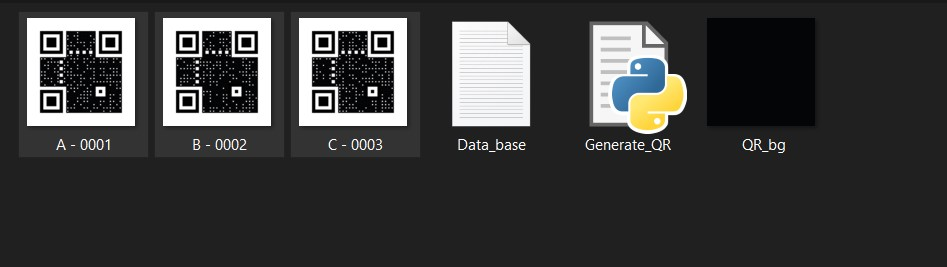
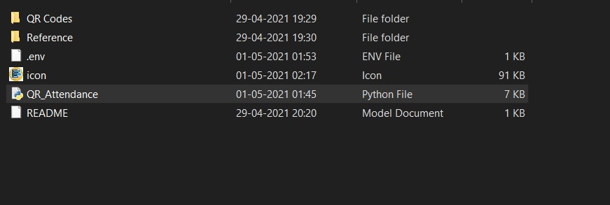
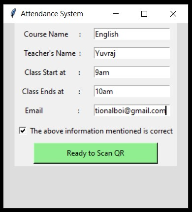
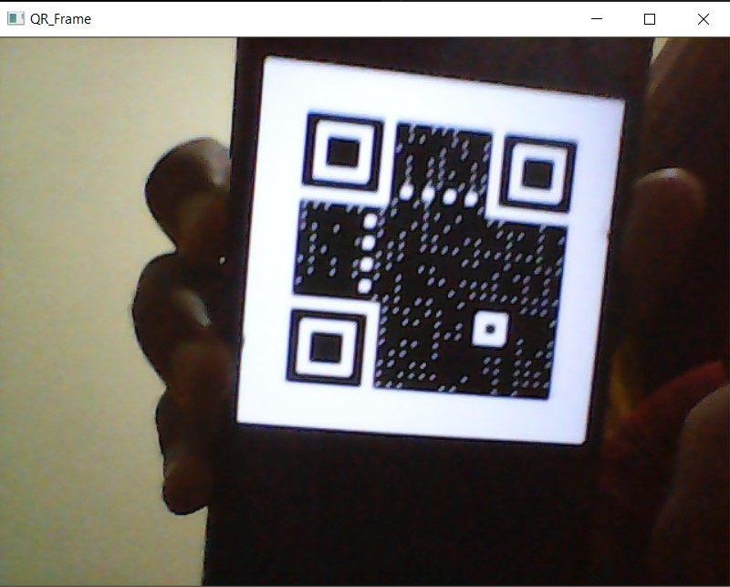
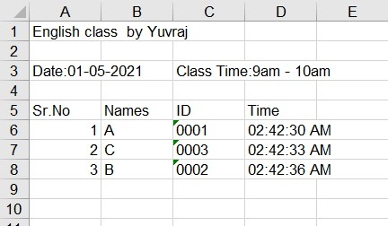
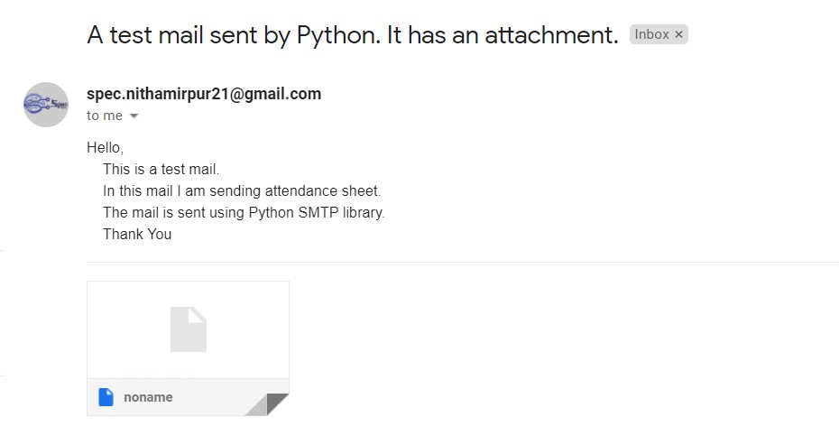
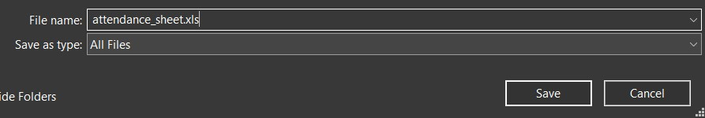
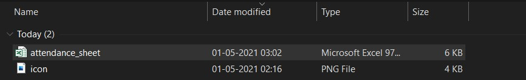

# QR-code-based-Excel-Attendace
* Freelancing Project

## How to generate QR code?

- In the `QR Codes` folder

1. Update the data base in file `Data_base.txt`. Make sure each students name resides in a new line without any space.  
  

2. Run the `Generate_QR.py` file by double clicking on it.  
  

3. Required QR code for the data base will be created.  
  

## How to take Attendace?

To Take attendace run the `QR_Attendance.py` file by double clicking on it.  

  

A GUI will pop up. Fill in the details to set the Attandace sytem for your class.  

Once the information is filled, checkout the box and click `Ready to Scan QR`. This will open up the terminal for conformation and camera to scan the QR. 

  

You will recive the conformation on terminal on successful scan.

Once everyone has scanned their QR, press `q` to quit the process. This will close the camera and save the attendance record in `.xls` format.

At the end this excel sheet is mailed to respective teacher in encoded format.

## How to Decode the Excel sheet ?
To decode the excel sheet , just download the file and save it with `.xls` extension.

That's it you got your required file.

