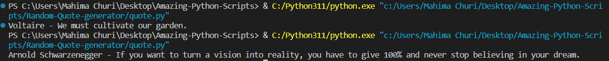

# Package/Script Name

- `requests` library is used, to make HTTP requests in Python
- `quote.py` script is used to generate random quotes by fetching them from public API endpoint

## Setup instructions

- Install python from [here](https://www.python.org/.)
- Install requests library using command : `pip install requests`

## Detailed explanation of script, if needed

The function `generate_quote()` make GET request to the public API endpoint, extracts the data in json format and displays in randomly to the user. It handles error if any in the `else` condition.

## Output

In text Format the output would be as follows :  
Arnold Schwarzenegger - If you want to turn a vision into reality, you have to give 100% and never stop believing in your dream.

## Author(s)

[Mahima Churi](https://github.com/Mahitej28)

## Disclaimers, if any

Any puplic API can be used for generating quotes, also datasets from Kaggle can also be imported and used.