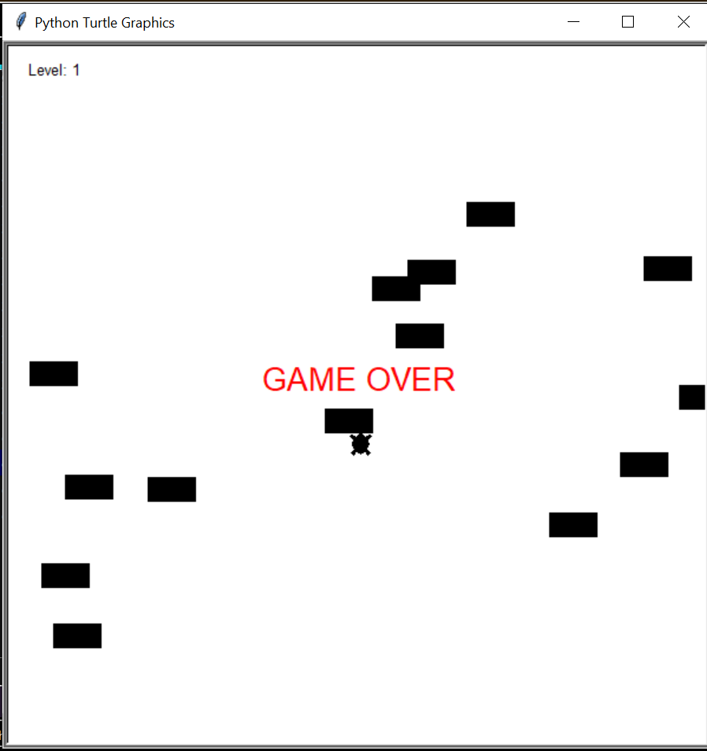

# Package/Script Name

main.py : to run the game  
player.py : to create a turtle  
car.py : to manage cars  
scoreboard.py : to display results  

## Setup instructions

python file.py

## Detailed explanation of script, if needed

This a road crossing game implemented using only the turtle module.Here,the target is to 
just go to the other side and cross the present level.If you get hit by any of
the cars on the road,you simply lose the game.

## Output

## Author(s)

[Anushka Pathak](https://github.com/anumshka)
