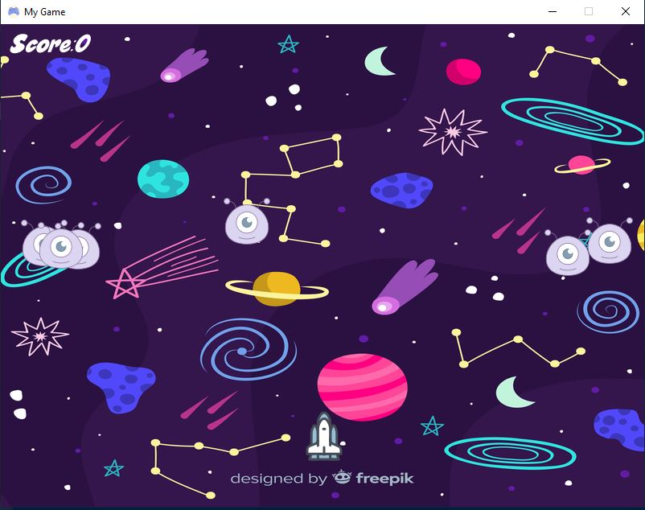
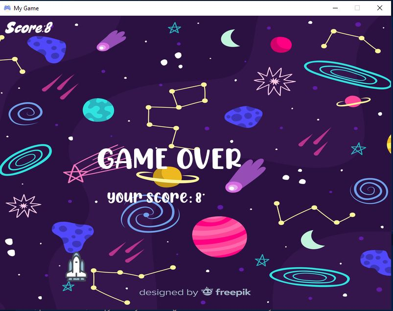
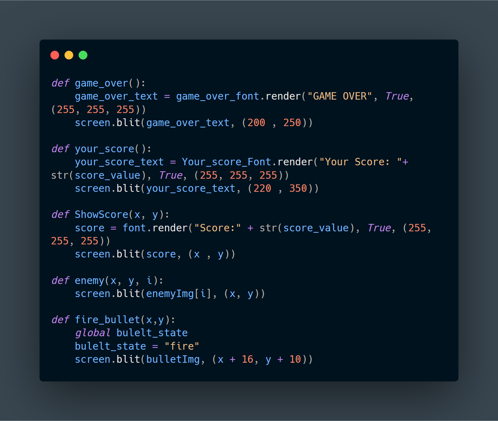
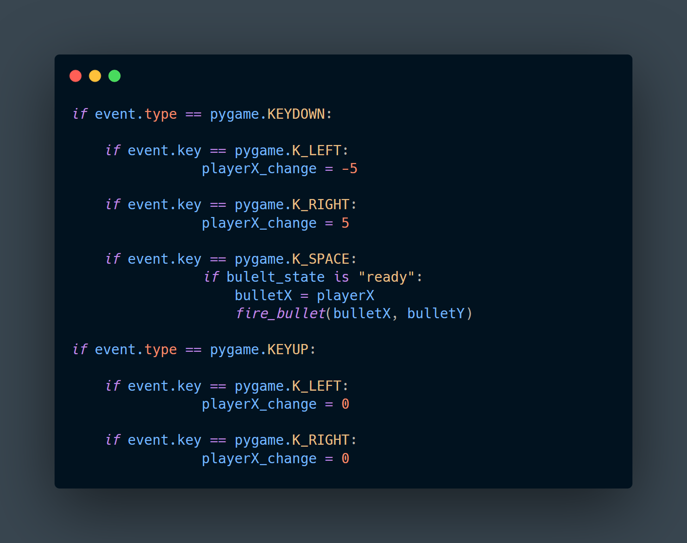

## Space War Game.

This is a game made purely with python. Libraries and modules used in this game are </br>
1) pygame </br>
2) mixer from pygame </br>
3) random </br>
4) math </br>

### Installing the package

```
pip install pygame
```
Run the above command in the terminal, to install the dependencies for this project

## Game Play Display



## Game Over Display



## Game Play Display


## Description

It is a game mainly made using the pygame module. sound, photos, icons, svg and fonts were taken from google. </br>

Rules and features of the game:</br>
1) There is a Spaceship, which is the main hero of the game.</br>
2) You can control the hero using the left and right arrowkwys in your keyboard. </br>
3) Press spacebar to shoot the enemies. </br>
4) Each time you shoot an enemy, your score will increase by 1. </br>
5) If the enemy touches you, the game will be over.</br>

## Code snippets of this game

 &nbsp;&nbsp;&nbsp;  

### Happy Gaming😀😀😀!!!

