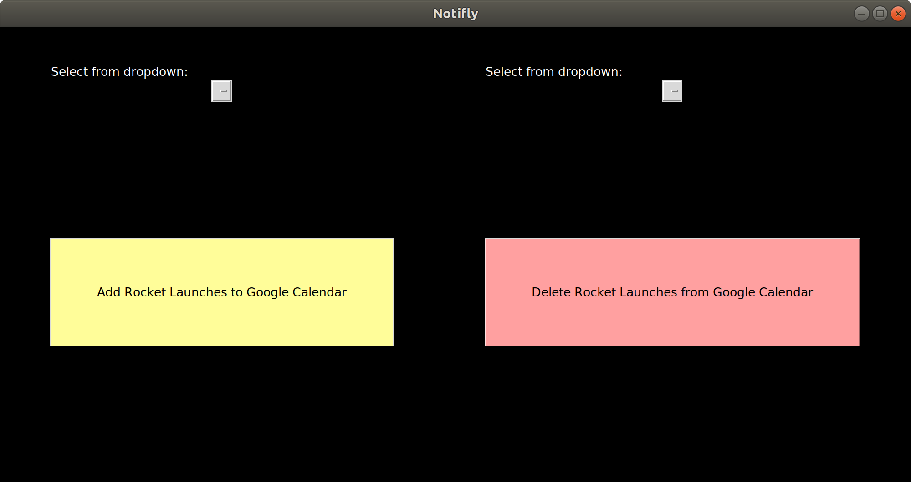

# Notifly
Note: This project uses Python 3.0+.  
To begin adding upcoming rocket launches to your Google Calendar automatically through Notifly, follow these steps:

## Setup Guide
1. Clone this repository and then travel to Google's Calendar API quickstart website:  
https://developers.google.com/calendar/quickstart/python
2. Follow steps 1 and 2 and save the *credentials.json* file in the same directory as the python scripts
3. If your .json file is not named *credentials.json*, then change the *api_credentials_json* variable in notifly.py accordingly
4. Install the BeautifulSoup python library according to their website: 
https://www.crummy.com/software/BeautifulSoup/bs4/doc/#installing-beautiful-soup

5. Install the python Tkinter library using the command:
   
   ```
   $ sudo apt-get install python3-tk
   ```
   
   OR install according to their website:  
   https://tkdocs.com/tutorial/install.html  
6. Run main_gui.py using:  
   ```
   python3 main_gui.py
   ```
   and choose one of the dropdown options followed by clicking the corresponding button, which should open your browser for
   authentication
7. Sign into your Google account, and click "Advanced" and then "go to <whatever the project name is (probably Quickstart)>"
8. Allow permissions and close out of the tab once you get the message saying that you can close the window
9. That's it, Notifly is now at your disposable to help you stay up to date with rocket launches forever!

GUI should look like this upon first startup of main_gui.py:  


## Functionality
The GUI has two major functionalities: __adding__ events and __deleting__ rocket launch events.

If this is your first time adding events, Notifly will create a new secondary calendar called "Rocket Launches by Notifly" in your Google Calendar account.

__Adding:__ You can add upcoming rocket launch events for 3 different periods of time:
1. This current month
2. This current month and the following month
3. This current month and two following months

To add, choose your desired period of time in the dropdown on the left side of the GUI and click the "Add Rocket Launches to Google Calendar" button. 

__Deleting:__ You have two options when it comes to deleting rocket launch events:
1. Select the month to delete events from
2. Delete the entire Notifly calendar and events

To delete, choose your option from the dropdown on the right side of the GUI and click "Delete Rocket Launches from Google Calendar" button.
