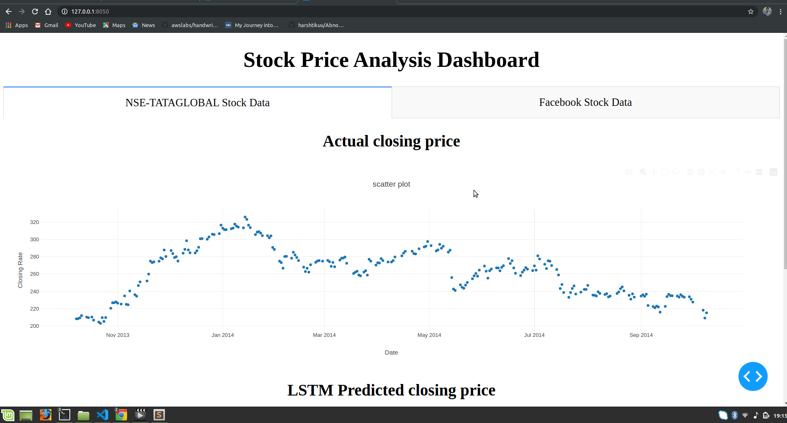

<h2 align=center> 📑 Stock Price Prediction </h2>

Machine learning has significant applications in the stock price prediction. In this machine learning project, we will be talking about predicting the returns on stocks. This is a very complex task and has uncertainties. We will develop this project into two parts:

First, we will predict stock price using the LSTM neural network. 
Then we will build a dashboard using Plotly dash for stock analysis.

<h3>Datasets</h3>

To build the stock price prediction model, we will use the NSE TATA GLOBAL dataset. This is a dataset of Tata Beverages from Tata Global Beverages Limited, National Stock Exchange of India: Tata Global Dataset
To develop the dashboard for stock analysis we will use another stock dataset with multiple stocks like Apple, Microsoft, Facebook: Stocks Dataset

