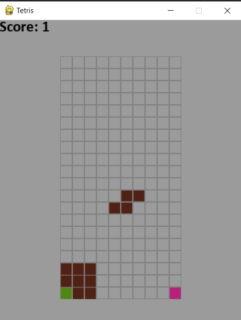
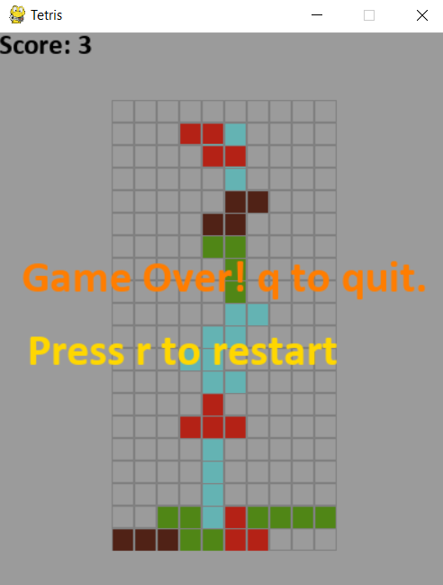

# Tetris : The Game

## Libraries used
* pygame==2.0.1
* random 

## Controls 
* The arrow buttons to move left and right.
* Space bar to skip the shape's path and place it to its final position.
* Upward arrow to rotate the shape.
* Downward button to move the shape faster.
* R to restart the game
* Q to quit the game

### Do run "pip install requirements.txt" before running the main.py file

## Ingame Images
* 
* 

### by [Swaroop Raj Lama](https://github.com/lachenlama)