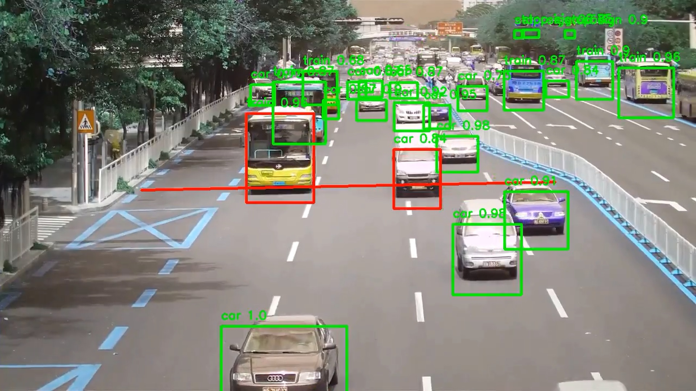
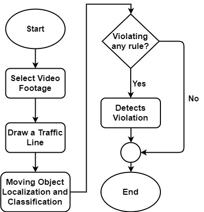
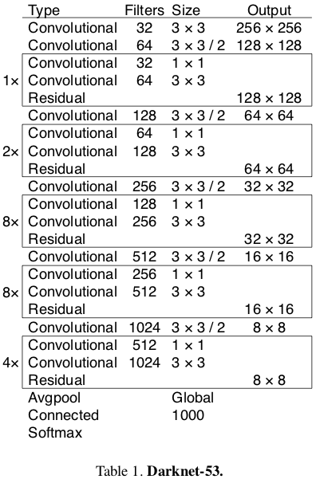
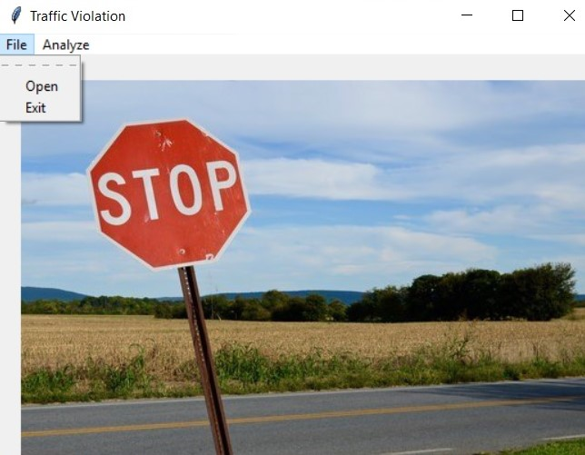
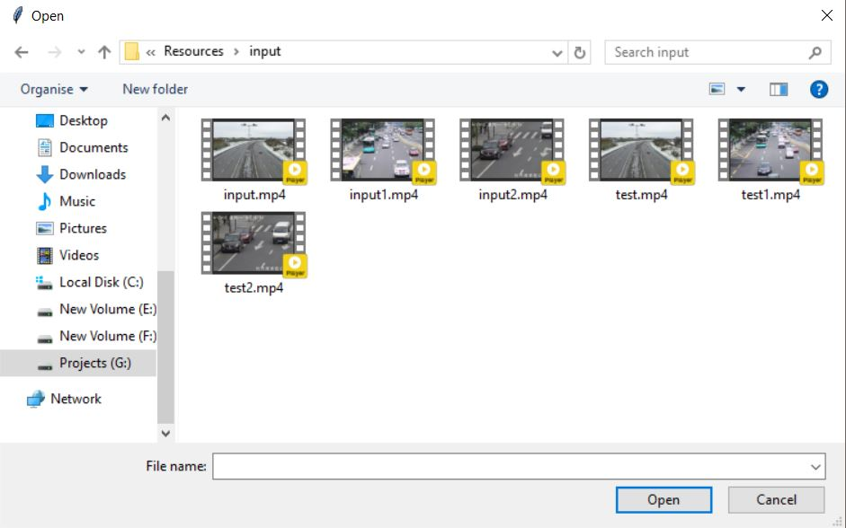
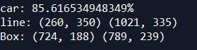
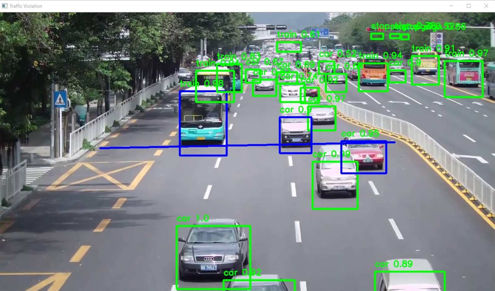

# Traffic Signal Violation Detection System using Computer Vision

 

## INTRO

This is a software for practice of developing a system from completely scratch. Understanding this will help a lot in system development and basic structure of a system along with computer vision, GUI with python library Tkinter and basic opencv.

Go [here](#quick-starting-the-project) if you don't have time.

## Introduction
The increasing number of cars in cities can cause high volume of traffic, and implies that traffic violations become more critical nowadays in India and also around the world. This causes severe destruction of property and more accidents that may endanger the lives of the people. To solve the alarming problem and prevent such unfathomable consequences, traffic violation detection systems are needed. For which the system enforces proper traffic regulations at all times, and apprehend those who does not comply. A traffic violation detection system must be realized in real-time as the authorities track the roads all the time. Hence, traffic enforcers will not only be at ease in implementing safe roads accurately, but also efficiently; as the traffic detection system detects violations faster than humans. This system can detect traffic light violation in real-time. A user friendly graphical interface is associated with the system to make it simple for the user to operate the system, monitor traffic and take action against the violations of traffic rules.

## Objectives
The goal of the project is to automate the traffic signal violation detection system and make it easy for the traffic police department to monitor the traffic and take action against the violated vehicle owner in a fast and efficient way. Detecting and tracking the vehicle and their activities accurately is the main priority of the system. 

## Quick starting the project
1. `git clone https://github.com/Killer2OP/Traffic-Signal-Violation-Detection-System.git`
2. Change the directories in "Project-GUI.py" & "object_detection.py"
3. Install required python dependencies into your python virtual environment.
4. `python Project-GUI.py`

## System Overview

            
     Figure-1: Flow diagram of traffic signal violation detection system.
The System consists of two main components -
* Vehicle detection model
* A graphical user interface (GUI)

First the video footage from the road side is sent to the system. Vehicles are detected from the footage. Tracking the activity of vehicles, system determines if there is any violation or not. Figure 1 shows how the system works.

The Graphical User Interface (GUI) makes the system interactive for the user to use. User can monitor the traffic footage and get the alert of violation with the detected bounding box of vehicle. User can take further action using the GUI. 

## Methodology
### Vehicle Classification
From the given video footage, moving objects are detected. An object detection model YOLOv3 is used to classify those moving objects into respective classes. YOLOv3 is the third object detection algorithm in YOLO (You Only Look Once) family. It improved the accuracy with many tricks and is more capable of detecting objects. The classifier model is built with Darknet-53 architecture. Table-1 shows how the neural network architecture is designed. 

### Violation detection

The vehicles are detected using YOLOv3 model. After detecting the vehicles, violation cases are checked. A traffic line is drawn over the road in the preview of the given video footage by the user. The line specifies that the traffic light is red. Violation happens if any vehicle crosses the traffic line in red state.

The detected objects have a green bounding box. If any vehicle passes the traffic light in red state, violation happens. After detecting violation, the bounding box around the vehicle becomes red.

## Implementation
### Computer Vision
OpenCV is an open source computer vision and machine learning software library which is used in this project for image processing purpose. Tensorflow is used for implementing the vehicle classifier with darknet-53. 

### Graphical User Interface (GUI)
The graphical user interface has all the options needed for the software. The software serves administration and other debugging purposes. We don’t need to edit code for any management. For example, if we need to open any video footage, we can do it with the Open item (Figure-2). 

     Figure-2: Initial user interface view.

Primarily, for the start of the project usage, the administrator needs to open a video footage using ‘Open’ item that can be found under ‘File’ (Figure-2). The administrator can open any video footage from the storage files (Figure-3).

     Figure-3: Opening a video footage from storage.

After opening a video footage from storage, the system will get a preview of the footage. The preview contains a frame from the given video footage. The preview is used to identify roads and draw a traffic line over the road. The traffic line drawn by administrator will act as a traffic signal line. To enable the line drawing feature, we need to select ‘Region of interest’ item from the ‘Analyze’ option (Figure-4). After that administrator will need to select two points to draw a line that specifies traffic signal.

     Figure-4: Region of Interest (Drawing signal line)

Selecting the region of interest will start violation detection system. The coordinates of the line drawn will be shown on console (Figure-5). The violation detection system will start immediately after the line is drawn. At first the weights will be loaded. Then the system will detect objects and check for violations. The output will be shown frame by frame from the GUI (Figure-6). 

     Figure-5: Line Coordinates (from console)

     Figure-6: Final Output (on each frame)

The system will show output until the last frame of the footage. In background a ‘output.mp4’ will be generated. The file will be in ‘output’ folder of ‘Resources’. The process will be immediately terminated by clicking ‘q’.

After processing a video footage, the administrator can add another video footage from the initial file manager (Figure-2). If the work is complete the administrator can quit using ‘Exit’ item from File option.

Libraries used for graphical user interface:
* Tkinter

      
