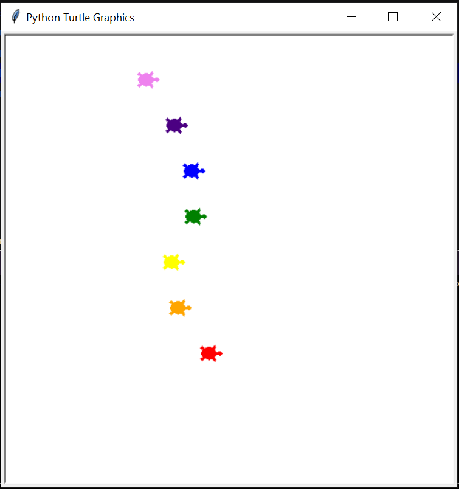

# Package/Script Name

TurtleRace.py : to make the turtles move

## Setup instructions

python file.py

## Detailed explanation of script, if needed

The user will bet on a turtle to win and a race would be hosted to see who wins.

## Output

## Author(s)

-[Anushka Pathak](https://github.com/anumshka)
