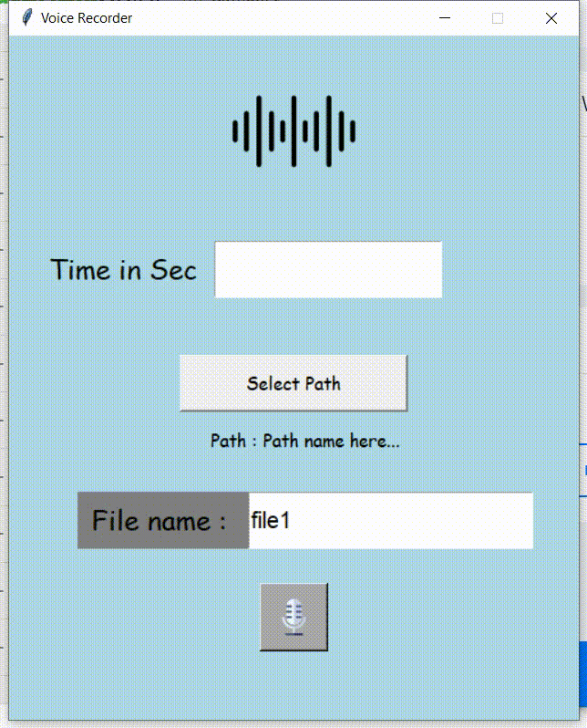

# Voice Recorder

This is a voice recording website.

Modules used:

1. Sounddevice
2. Scipy
3. Tkinter

## Setup instructions

`Step 1` : Install all the modules

```bash
pip install sounddevice
pip install scipy
```

`Step 2` : Run the main script file

```bash
python main.py
```

## Output



## Contributor

#### This project was contributed by Atharvashirsh Tiwary.

👾 Follow me on Github : [@Atharvashirsh](https://github.com/Atharvashirsh)

🤖 Connect with me and say Hi on LinkedIn : [@atharvashirsh](https://www.linkedin.com/in/atharvashirsh)

🐦 Follow me on Twitter : [@atharva_tiwary](https://www.twitter.com/atharva_tiwary)
