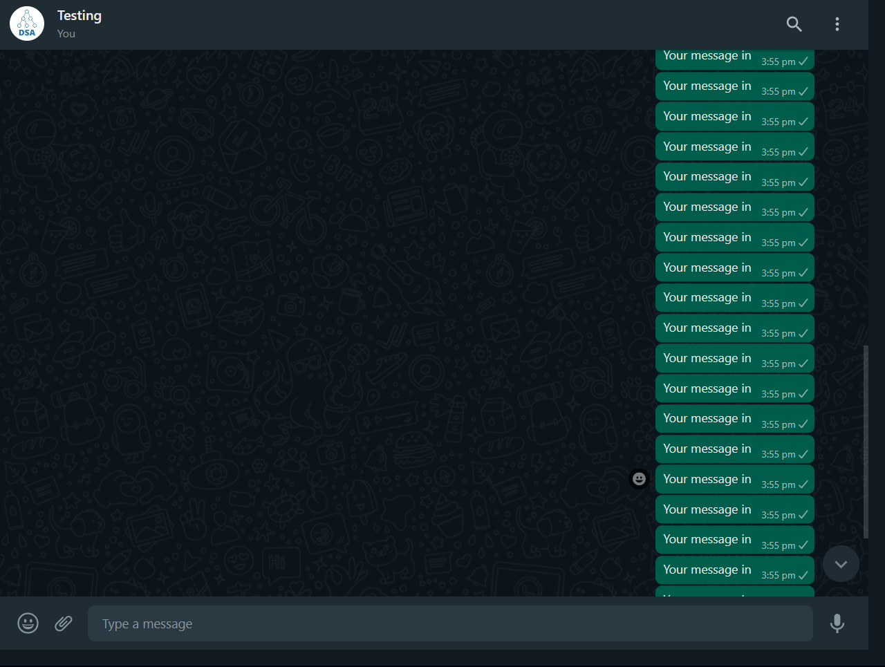

# Package/Script Name

Short description of package/script

- pyautogui:To automate the GUI and Pressing the key
- webbrowser:To open the webbrowser
- time:For giving a sleep time

## Setup instructions

You can install these using pip install
pip install -r requirements.txt

## Detailed explanation of script, if needed

## Output

## Author(s)

Harsh Pandey

## Disclaimers, if any

Use it just for fun and not for any unethical purpose