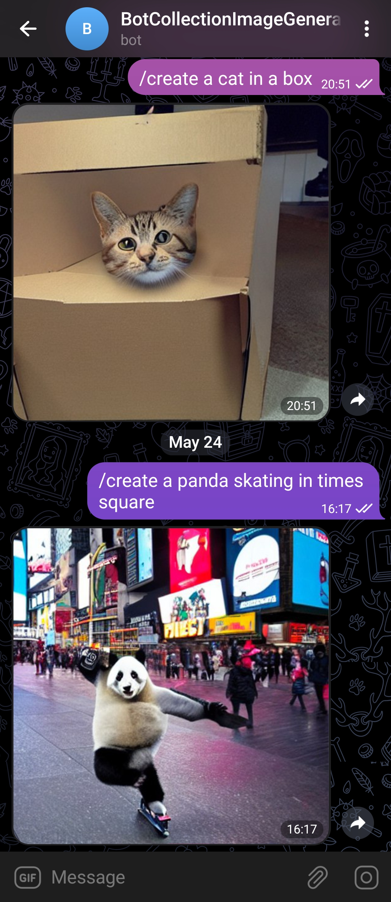

# Telegram AI Image Generator Bot 
Hi👋 I'm an AI Image generator bot🤖. I can create original images from a single text prompt!

# Screenshot

# Getting Started
Now we are gonna go through how you can create your own image generator AI bot. So exciting 😋. Here are a few prerequisites:-

## Prerequisites

 - Python
 - Telegram Bot API Key
 - Replicate Stable Diffusion API Key

## Installation

 

 1. Get a free telegram bot API key from @BotFather telegram bot. 
 2. Also get a free stable diffusion API key from https://replicate.com/account/api-tokens

 3. Clone the repo
`git clone https://github.com/neelshah2409/Bot-Collection`
`cd ai_image_generation_telegram_bot`
 3. Install the requirements from the requirements.txt file
 ` pip install -r requirements.txt`
 4. Enter the bot token from BotFather in the **TELEGRAM_BOT_TOKEN** in the .env file.
 5. Enter the bot token from Replicate in the **REPLICATE_API_TOKEN** in the .env file.
 6. Now run the ai_bot.py file and start chatting.

# Bot Commands
You can see a list of commands by typing */help*

| Command |                                                             Description |
|:--------|------------------------------------------------------------------------:|
| /start  |                                                    Start a conversation |
| /help   |                                          Get a list of all the commands |
|   /create `prompt`      |                              Create an image based on the given command |

#
*Created by [Arnav Kohli](https://github.com/THEGAMECHANGER416)*