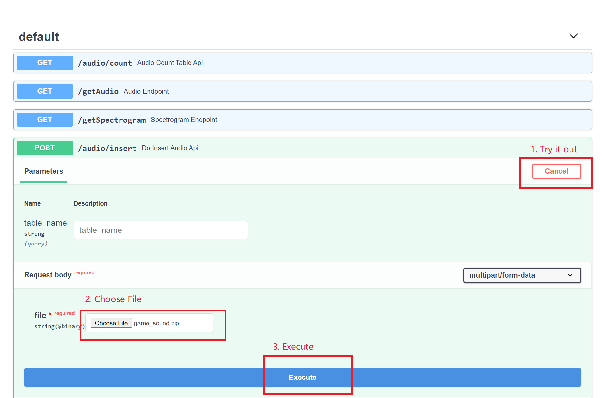
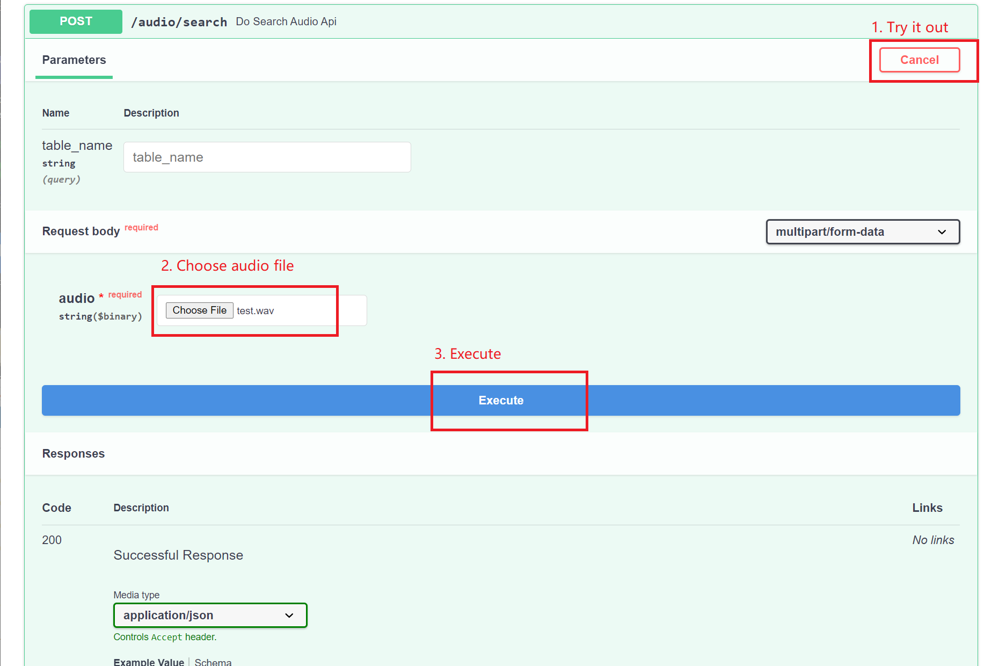

:exclamation::exclamation: **This repo will no longer be maintained, please visit https://github.com/milvus-io/bootcamp** :exclamation: :exclamation:

# Audio search system with Milvus

This project uses [PANNs](https://github.com/qiuqiangkong/audioset_tagging_cnn)(Large-Scale Pretrained Audio Neural Networks) for Audio Pattern Recognition to perform audio tagging and sound event detection, finally obtaining audio embeddings. Then this project uses [Milvus](https://milvus.io/docs/v0.11.0/overview.md) to search for similar audio clips.

## Local Deployment

### Requirements

- [Milvus 0.10.5](https://milvus.io/docs/v0.10.5/milvus_docker-cpu.md) (please note the Milvus version)
- [MySQL](https://hub.docker.com/r/mysql/mysql-server)
- [Python3](https://www.python.org/downloads/)

### Run Server

1. **Install python requirements**

   ```bash
   $ cd bootcamp/solutions/audio_search/webserver/
   $ pip install -r audio_requirements.txt
   ```

2. **Modify configuration parameters**

   Before running the script, please modify the parameters in **webserver/audio/common/config.py**:

   | Parameter    | Description               | Default setting |
   | ------------ | ------------------------- | --------------- |
   | MILVUS_HOST  | milvus service ip address | 127.0.0.1       |
   | MILVUS_PORT  | milvus service port       | 19530           |
   | MYSQL_HOST   | mysql service ip     | 127.0.0.1       |
   | MYSQL_PORT   | mysql service port   | 3306            |
   | MYSQL_USER   | mysql user name      | root            |
   | MYSQL_PWD    | mysql password       | 123456          |
   | MYSQL_DB     | mysql datebase name  | mysql           |
   | MILVUS_TABLE | default table name        | milvus_audio    |

3. **Star server**

   ```bash
   $ cd webserver
   $ python main.py
   ```

## System Usage

Type `127.0.0.1:8002/docs` in your browser to see all the APIs.


- Insert data.

  Download the sample [game_sound.zip](https://github.com/shiyu22/bootcamp/blob/0.11.0/solutions/audio_search/data/game_sound.zip?raw=true) and upload it into the system.

  > The sound data in the zip archive must be in wav format.

  

- Search for similar audio clips.

  You can upload [test.wav](https://github.com/shiyu22/bootcamp/blob/0.11.0/solutions/audio_search/data/test.wav) to search for the most similar sound clips.
  
  

Please refer to https://zilliz.com/demos/ to take a try in the front-end interface.
